# Todo Angular based on angular 19.x.x standalone

[https://github.com/mbachmann/todo-angular-19-standalone.git](https://github.com/mbachmann/todo-angular-19-standalone.git)

## Content

- [Create a new Project](#create-a-new-project)
- [Prepare Intellij for Karma Debugging](#prepare-intellij-for-karma-debugging)
- [Install EsLint with Prettier](#install-eslint-with-prettier)
- [Install the OpenApi Tools](#install-the-openapi-tools)
- [Generate the Model and the Backend API](#generate-the-model-and-the-backend-api)
- [Install Bootstrap](#install-bootstrap)
- [Install FontAwesome](#install-fontawesome)
- [Create a utils file](#create-a-utils-file)
- [Create the myFirst component](#create-the-myfirst-component)
- [Create an own Service](#create-an-own-service)
- [Create the TodoLists component](#create-the-todolists-component)
- [Display the TodoLists component through the router](#display-the-todolists-component-through-the-router)
- [Create the TodoItems component](#create-the-todoitems-component)
- [Add the Routings for the TodoItemComponent](#add-the-routings-for-todoitemscomponent)
- [Define the AppComponent](#redefine-the-appcomponent)
- [Add global styles](#add-global-styles)
- [Add the image todo.svg](#add-the-image-todosvg-to-the-public-folder)
- [Create a Docker Container](#create-a-docker-container-run-and-publish-to-docker)
- [Run the App with a docker-compose.yml file](#run-the-app-with-a-docker-compose-file)
- [Create a Dockerfile](#create-a-dockerfile)
- [Create a docker-compose file](#create-a-docker-composeyml-file)

## Preview

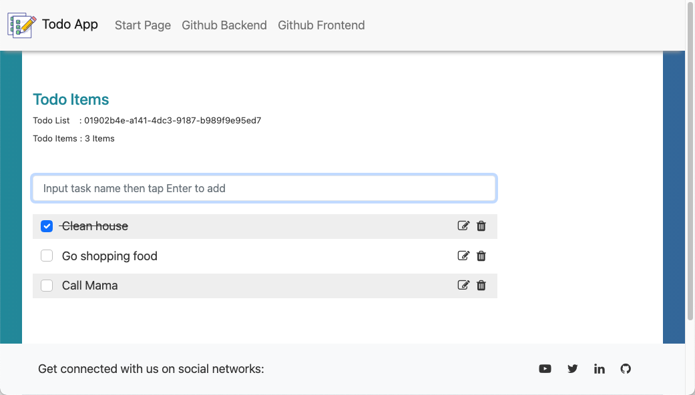

<br>

## Prerequisites

Both the CLI and generated project have dependencies that require Node 18.19.1 or higher, together with NPM 10.7.0 or higher.

The related Spring Boot Backend can be found here: [https://github.com/mbachmann/spring-boot-todo-app](https://github.com/mbachmann/spring-boot-todo-app)

## Links

- [Angular Home](https://angular.io/)
- [Angular Cli Github](https://github.com/angular/angular-cli)
- [Angular Cli Home](https://cli.angular.io/)

### Clean up old Angular cli version

```sh
    npm uninstall -g angular-cli
```

### New Installation

Global package:

```sh
    npm install -g @angular/cli@latest
```

## Create a new project

Create new project with angular-cli:

    ng new PROJECT_NAME

Go into project directory:

    cd PROJECT_NAME

Replace `PROJECT_NAME` with e.g. `todo-angular`.

- The `new` command will generate a standalone project. For the traditional
  aproach the --no-standalone option has to be added.
- For the stylesheet format you can use `scss`. We will use in the tutorial scss.

```sh
ng new todo-angular
  CSS
❯ SCSS   [ https://sass-lang.com/documentation/syntax#scss                ]
  Sass   [ https://sass-lang.com/documentation/syntax#the-indented-syntax ]
  Less   [ http://lesscss.org                                             ]

  ? Do you want to enable Server-Side Rendering (SSR) and Static Site Generation (SSG/Prerendering)?
(y/N) N
```

## Development server

Run `ng serve` for a dev server. Navigate to `http://localhost:4200/`. The app will automatically reload if you change any of the source files.

## Code scaffolding

Run `ng generate component component-name` to generate a new component. You can also use `ng generate directive|pipe|service|class|guard|interface|enum|module`.

## Build

Run `ng build` to build the project. The build artifacts will be stored in the `dist/` directory.

## Running unit tests

Run `ng test` to execute the unit tests via [Karma](https://karma-runner.github.io).

## Further help

To get more help on the Angular CLI use `ng help` or go check out the [Angular CLI Overview and Command Reference](https://angular.io/cli) page.

## Prepare Intellij for Karma Debugging

We need to create a Karma config file by using the terminal at the root of the project:

```sh
ng generate config karma
```

This will produce a file `karma.conf.js`. More info [here](https://angular.dev/guide/testing):

Add a new configuration in IntelliJ:

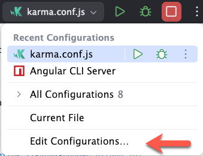

Add a Karma configuration:

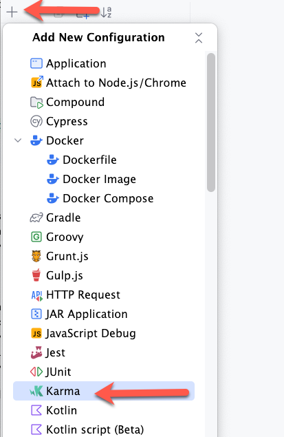

Edit the Configuration:

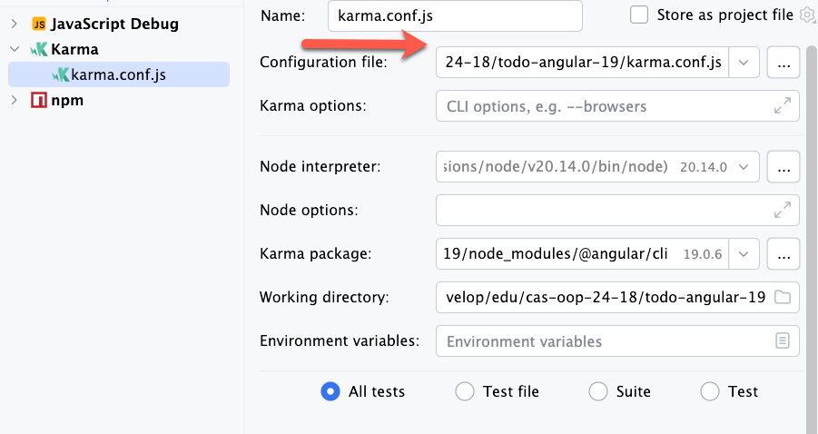

## Install EsLint with Prettier

In web application development, using Angular as a reference framework, maintaining a clean, consistent and
well-formatted code is crucial for the quality and maintainability of the project.
Two tools to achieve this goal are ESLint and Prettier.

### What is ESLint and what is Prettier?

ESLint is a static code analysis tool focused on finding and correcting problems in JavaScript code and
other JavaScript-based languages, such as TypeScript; it is used to maintain cleaner, more consistent and error-free code.
Prettier is a code formatting tool used to ensure that source code follows a
consistent formatting style. It supports multiple programming languages and
integrates easily with various development environments and text editors.

### How do we install it?

First, we will have to go inside our Angular project through a terminal.
And we will install `ESLint` introducing the following command:

```sh
ng add @angular-eslint/schematics
```

Two files have been modified and one has been added.
The two modified files are `package.json` and `angular.json`;
and the added `.eslintrc.json`.

### Install Prettier

Second, we will install `Prettier`, and we will do it by entering the following command:

```sh
npm install prettier --save-dev
```

With this command we have added the Prettier dependency to our `package.json`.
In order to set up our Prettier rules we will have to create the following file in the `root` of the project: `.prettierrc.json` and `.prettierignore`.
See the following link for the available Prettier rules. [https://prettier.io/docs/en/options.html](https://prettier.io/docs/en/options.html)

**.prettierrc.json**

```json
{
  "tabWidth": 2,
  "useTabs": false,
  "singleQuote": true,
  "semi": true,
  "bracketSpacing": true,
  "arrowParens": "avoid",
  "trailingComma": "es5",
  "bracketSameLine": true,
  "printWidth": 80,
  "overrides": [
    {
      "files": ["*.html", "*.ts"],
      "options": {
        "printWidth": 120
      }
    },
    {
      "files": "*.html",
      "options": {
        "parser": "html"
      }
    },
    {
      "files": "*.component.html",
      "options": {
        "parser": "angular"
      }
    }
  ]
}
```

**.prettierignore**

```sh
package.json
package-lock.json
.eslintrc.json
tsconfig.json
dist
/.angular/cache
lint-*

```

Add the following scripts to `package.json`:

```json
 "scripts": {
    ...

    "prettier:write": "prettier --config .prettierrc.json --write .",
    "prettier:check": "prettier --config .prettierrc.json --check ."
  },
```

We can check the installation by running the scripts:

```sh
npm run prettier:check
npm run prettier:write
```

`Check` informs you about the code issues and `write` is fixing them.

### Install ESLint

Finally, to make Prettier work with ESLint, enter the following command in the terminal:

```sh
npm install prettier-eslint eslint-config-prettier eslint-plugin-prettier --save-dev
```

Once installed, we must include the prettier plugin in the file `eslint.config.ts`:

**eslint.config.ts**

```ts
// @ts-check
// @ts-check
const eslint = require('@eslint/js');
const tseslint = require('typescript-eslint');
const angular = require('angular-eslint');

const eslintPluginPrettierRecommended = require('eslint-plugin-prettier/recommended');

module.exports = tseslint.config(
  {
    files: ['**/*.ts'],
    extends: [
      eslint.configs.recommended,
      ...tseslint.configs.recommended,
      ...tseslint.configs.stylistic,
      ...angular.configs.tsRecommended,
      eslintPluginPrettierRecommended,
    ],
    ignores: ['src/app/openapi-gen/*'],
    processor: angular.processInlineTemplates,
    rules: {
      '@angular-eslint/directive-selector': [
        'error',
        {
          type: 'attribute',
          prefix: 'app',
          style: 'camelCase',
        },
      ],
      '@angular-eslint/component-selector': [
        'error',
        {
          type: 'element',
          prefix: 'app',
          style: 'kebab-case',
        },
      ],
      '@typescript-eslint/no-explicit-any': ['off'],
    },
  },
  {
    files: ['**/*.html'],
    extends: [
      ...angular.configs.templateRecommended,
      ...angular.configs.templateAccessibility,
      eslintPluginPrettierRecommended,
    ],
    rules: {
      // "@angular-eslint/template/interactive-supports-focus":["off"]
    },
  }
);
```

Disable the next line from linting:

```typescript
// eslint-disable-next-line
```

In typescript, we can disable several lines from linting by using:

```typescript
  /* eslint-disable */
  ..
  /* eslint-enable */
```

In `HTML` we can disable several lines from linting by using:

```html
<!-- eslint-disable -->
...
<!-- eslint-enable -->
```

If we run `ng lint` we are likely to get multiple lint errors. If we want simple errors to be fixed quickly,
we will type `ng lint --fix`; some of them may need to be manually modified by us.

We can add the linting scripts to `package.json`:

```json
 "scripts": {
    ...

    "lint:check": "ng lint",
    "lint:fix": "ng lint --fix",
    "prettier:write": "prettier --config .prettierrc.json --write .",
    "prettier:check": "prettier --config .prettierrc.json --check ."
  },
```

We can check the installation by running the scripts:

```sh
npm run lint:check
npm run lint:fix
```

## Install the OpenApi Tools

```sh
npm i -D  @openapitools/openapi-generator-cli
```

create the folder `src/app/openapi`.

Put the yaml file `api-docs.yaml` from https://todo-h2.united-portal.com/v3/api-docs.yaml in the folder `src/app/openapi`.

Add the `generate:api` command to the scripts section of `package.json` (the last line needs eventually a comma to fulfill the json rules).

```json
  "scripts": {
    ...
    ...
    "generate:api": "openapi-generator-cli generate -g typescript-angular -i  src/app/openapi/api-docs.yaml -o src/app/openapi-gen"
  },
```

Create a file `openapitools.json` in the root of the project and adjust the version to 5.3.0 of the generator:

```json
{
  "$schema": "node_modules/@openapitools/openapi-generator-cli/config.schema.json",
  "spaces": 2,
  "generator-cli": {
    "version": "5.3.0"
  }
}
```

## Generate the Model and the Backend API

Having one file to define your API is helpful and can save you a lot of development time and prevent possible bugs
caused by different models or API implementations in your frontend and backend code.

OpenAPI provides a good specification with helpful documentation.
Additionally, many existing backends use Swagger for their API documentation, therefore it should also be possible
to use this code generation for frontend applications where you cannot to modify the corresponding backend.

Due to the many supported languages and frameworks, it can be used in nearly every project,
and the initial setup is not very hard.

The _model_ and _api_ is generated based on the `api-docs.yaml` file in the folder `src/app/openapi-gen`. The following command creates the files.

```sh
npm run generate:api
```

The generator puts the code to the `src/app/openapi-gen` folder.

<br>

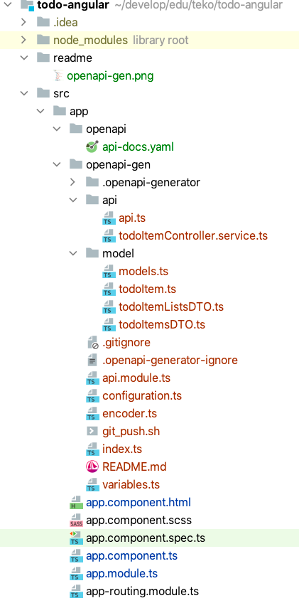

<br>

**Don't forget adding the generated files to git!**

<br>

Create the environment files:

```
ng generate environments
```

src/environments
|- environment.ts
|- environment.development.ts
|- environment.staging.ts (.. not generated ..)

Add the url to the backend to the files `enviroments/enviroment.ts` and `enviroment.prod.ts`.

**environment.ts**

```typescript
export const environment = {
  production: true,
  API_BASE_PATH: 'https://todo-h2.united-portal.com',
};
```

**environment.development.ts**

```typescript
export const environment = {
  production: false,
  API_BASE_PATH: 'https://todo-h2.united-portal.com',
};
```

<br>

Add the generated **ApiModule** to the `app.config.ts`. The Module has a dependency to the HttpClient and the environment base path.

```typescript
import {
  ApplicationConfig,
  importProvidersFrom,
  provideZoneChangeDetection,
} from '@angular/core';
import { provideRouter } from '@angular/router';

import { routes } from './app.routes';
import { ApiModule, BASE_PATH } from './openapi-gen';
import {
  provideHttpClient,
  withInterceptorsFromDi,
} from '@angular/common/http';
import { environment } from '../environments/environment';

export const appConfig: ApplicationConfig = {
  providers: [
    provideZoneChangeDetection({ eventCoalescing: true }),
    provideRouter(routes),
    importProvidersFrom(ApiModule),
    {
      provide: BASE_PATH,
      useValue: environment.API_BASE_PATH,
    },
    provideHttpClient(withInterceptorsFromDi()),
  ],
};
```

Verify the code generation by restarting the project again.

## Install Bootstrap

We are styling the TodoApp with Bootstrap 5.x.

```sh
npm install --save @popperjs/core
npm install --save bootstrap
```

Please add below code into `angular.json` file:

```json
"styles": [
              ...

              "node_modules/bootstrap/dist/css/bootstrap.min.css",
              "src/styles.scss"
          ],
"scripts": [
              ...
              "node_modules/@popperjs/core/dist/umd/popper.min.js",
              "node_modules/bootstrap/dist/js/bootstrap.min.js"
           ]
```

Please add below code into `styles.scss` file:

```scss
@use 'bootstrap/scss/bootstrap';
```

## Install FontAwesome

```sh
npm install --save @fortawesome/fontawesome-free
```

Please add below code into `angular.json` file:

```json
"styles": [
              "node_modules/bootstrap/dist/css/bootstrap.min.css",
              "node_modules/@fortawesome/fontawesome-free/css/all.css",
              "src/styles.scss"
          ],
```

Please add below code into `styles.scss` file:

```scss
@use '@fortawesome/fontawesome-free/scss/fontawesome';
```

## Create a utils file

Create a folder `src/app/shared`. In this folder create a file `utils.ts`.This file contains a data reviver function,
restoring a ISO8601 string to a Date object a function `getUUID` to create a UUID.

```typescript
const isoDateFormat =
  /(\d{4}-[01]\d-[0-3]\dT[0-2]\d:[0-5]\d:[0-5]\d\.\d+([+-][0-2]\d:[0-5]\d|Z))|(\d{4}-[01]\d-[0-3]\dT[0-2]\d:[0-5]\d:[0-5]\d([+-][0-2]\d:[0-5]\d|Z))|(\d{4}-[01]\d-[0-3]\dT[0-2]\d:[0-5]\d([+-][0-2]\d:[0-5]\d|Z))/;

export function parseIsoDateStrToDate(value: any) {
  if (typeof value === 'string' && isoDateFormat.test(value)) {
    return new Date(value);
  }
  return value;
}

export function getUUID() {
  let result = '';
  let hexcodes = "0123456789abcdef".split("");

  for (let index = 0; index < 32; index++) {
    let value = Math.floor(Math.random() * 16);

    switch (index) {
      case 8:
        result += '-';
        break;
      case 12:
        value = 4;
        result += '-';
        break;
      case 16:
        value = value & 3 | 8;
        result += '-';
        break;
      case 20:
        result += '-';
        break;
    }
    result += hexcodes[value];
  }
  return result;
}
```

Create a folder `src/app/shared/directive`. In this folder create the files 

- `click-stop-propagation.directive.ts` and
- `keydown-stop-propagation.directive.ts`

The directive can be used in the HTML template to stop the propagation of the click and keydown events.

**click-stop-propagation.directive.ts**

```typescript
import {Directive, HostListener} from "@angular/core";

@Directive({
  selector: "[click-stop-propagation]"
})
export class ClickStopPropagation
{
  @HostListener("click", ["$event"])
  public onClick(event: any): void
  {
    event.stopPropagation();
  }
}
```

**keydown-stop-propagation.directive.ts**

```typescript
import {Directive, HostListener} from "@angular/core";

@Directive({
  selector: "[keydown-stop-propagation]"
})
export class KeydownStopPropagationDirective
{
  @HostListener("keydown", ["$event"])
  public onKeydown(event: any): void
  {
    event.stopPropagation();
  }
}
```

The directives will be used later for the `TodoListsComponent`.


## Create the MyFirst component

We want to create a Mouse Tracking Component which shows the current coordinate of the mouse
and the state of the mouse click.

This component demonstrates fundamental Angular concepts, including property binding,
event binding, and event handling.
It is designed to capture mouse and keyboard events,
interact dynamically with a parent component,
and manage both input and output properties effectively.

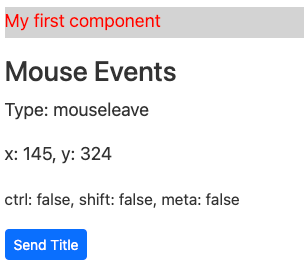

We create the source code files through angular cli:

```sh
ng generate component MyFirst
```

The cli has created four different files:

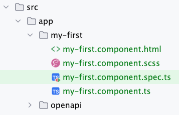

**CSS Rules**

We add the following _css rules_ to the file `my-first.component.scss`:

```css
.paragraph {
  padding-bottom: 3px;
}
```

**The component class file**

The component file `my-first.component.ts` contains the logic with the methods
to display the event and the coordinates:

```typescript
import { Component, EventEmitter, Input, Output } from '@angular/core';

@Component({
  selector: 'app-my-first',
  templateUrl: './my-first.component.html',
  styleUrls: ['./my-first.component.scss'],
})
export class MyFirstComponent {
  @Input() headerTitle = 'My first component';
  @Output() myEvent = new EventEmitter<string>();

  backgroundColor = 'lightgray';
  textColor = 'red';

  public event?: MouseEvent;
  public clientX = 0;
  public clientY = 0;
  public onEvent(event: MouseEvent): void {
    this.event = event;
  }
  public coordinates(event: MouseEvent): void {
    this.clientX = event.clientX;
    this.clientY = event.clientY;
  }

  sendEvent() {
    this.myEvent.emit(this.headerTitle);
  }

  onKeyEvent($event: Event) {
    console.log($event);
  }
}
```

### Explanation of the code

**Component Decorator**

```typescript
@Component({
selector: 'app-my-first',
templateUrl: './my-first.component.html',
styleUrls: ['./my-first.component.scss'],
})
```

- `selector`: Defines the custom HTML tag for the component (`<app-my-first>`).
- `templateUrl`: Specifies the path to the HTML template that defines the component’s structure.
- `styleUrls`: Points to the CSS/SCSS file for the component’s styling.

**Class Properties**

```typescript
@Input() headerTitle = 'My first component';
@Output() myEvent = new EventEmitter<string>();

backgroundColor = 'lightgray';
textColor = 'red';

public event?: MouseEvent;
public clientX = 0;
public clientY = 0;
```

- `headerTitle`: An input property that allows the parent component to pass a string value to this component.
  It has a default value of `My first component`.
- `myEvent`: An output property that emits a string event to the parent component using EventEmitter.
- `backgroundColor` and `textColor`: Define default colors for the component’s appearance.
- `event`, `clientX`, `clientY`: Used to store information about mouse events,
  such as the event object itself and the x/y coordinates of the cursor.

**HTML Template**

We insert following template code into the file `my-first.component.html`.

This Angular template demonstrates dynamic data binding, interactive event handling, and responsive styling.
It provides a solid foundation for creating user interfaces that respond to user interactions in real-time.

```html
<p
  class="paragraph"
  [style.background-color]="backgroundColor"
  [style.color]="textColor">
  {{ headerTitle }}
</p>

<h3 class="title">Mouse Events</h3>
<div
  class="box"
  tabindex="1"
  (mouseenter)="onEvent($event)"
  (mouseleave)="onEvent($event)"
  (mousemove)="coordinates($event)"
  (click)="onEvent($event)"
  (keydown.enter)="onKeyEvent($event)"
  (dblclick)="onEvent($event)"
  on-contextmenu="onEvent($event)">
  <!-- (event)="" or on-event="" -->
  <p class="type">Type: {{ event?.type }}</p>
  <p>x: {{ clientX }}, y: {{ clientY }}</p>
  <p>
    <small
      >ctrl: {{ event?.ctrlKey }}, shift: {{ event?.shiftKey }}, meta: {{
      event?.metaKey }}</small
    >
  </p>
</div>

<div>
  <button class="btn btn-primary btn-sm" (click)="sendEvent()">
    Send Title
  </button>
</div>
```

### Template Breakdown

#### 1. Paragraph Element

```html
<p
  class="paragraph"
  [style.background-color]="backgroundColor"
  [style.color]="textColor">
  {{ headerTitle }}
</p>
```

**Features**

- **Dynamic Styling**:

  - `[style.background-color]="backgroundColor"`: Dynamically sets the background color using the backgroundColor property from the component.

  - `[style.color]="textColor"`: Dynamically sets the text color using the textColor property from the component.

- **Data Binding**:

  - {{ headerTitle }}: Interpolates the value of the headerTitle property from the component and displays it as text content.

#### 2. Mouse Events Section

```html
<h3 class="title">Mouse Events</h3>
```

Displays a static title for the section.

**Interactive Box**

```html
<div
  class="box"
  tabindex="1"
  (mouseenter)="onEvent($event)"
  (mouseleave)="onEvent($event)"
  (mousemove)="coordinates($event)"
  (click)="onEvent($event)"
  (keydown.enter)="onKeyEvent($event)"
  (dblclick)="onEvent($event)"
  on-contextmenu="onEvent($event)"></div>
```

**Features:**

- **Styling and Accessibility:**

  - `class="box"`: Applies styles defined in the corresponding CSS.
  - `tabindex="1"`: Makes the div focusable using the Tab key.

- **Event Binding:**

  - `(mouseenter)`: Triggers `onEvent($event)` when the mouse enters the div.
  - `(mouseleave)`: Triggers `onEvent($event)` when the mouse leaves the div.
  - `(mousemove)`: Calls `coordinates($event)` to track the mouse's position.
  - `(click)`: Calls `onEvent($event)` on a click.
  - `(keydown.enter)`: Triggers `onKeyEvent($event)` when the Enter key is pressed while the div is focused.
  - `(dblclick)`: Calls `onEvent($event)` on a double click.
  - `on-contextmenu="onEvent($event)"`: Handles right-click or context menu events.

**Dynamic Content Display**

```html
<p class="type">Type: {{ event?.type }}</p>
<p>x: {{ clientX }}, y: {{ clientY }}</p>
<p>
  <small
    >ctrl: {{ event?.ctrlKey }}, shift: {{ event?.shiftKey }}, meta: {{
    event?.metaKey }}</small
  >
</p>
```

- **Binding with Safe Navigation Operator:**

`{{ event?.type }}`: Displays the type of the last event.
`{{ event?.ctrlKey }}`, `{{ event?.shiftKey }}`, `{{ event?.metaKey }}`: Shows the state of modifier keys.

- **Mouse Coordinates:**

`{{ clientX }}`, `{{ clientY }}`: Displays the x and y coordinates of the mouse pointer.

#### 3. Button Element

```html
<div>
  <button class="btn btn-primary btn-sm" (click)="sendEvent()">
    Send Title
  </button>
</div>
```

**Features:**

- **Styling**:

  - `class="btn btn-primary btn-sm"`: Applies pre-defined Bootstrap button styles for small, primary buttons.

- **Event Binding**:

  - `(click)="sendEvent()"`: Triggers the `sendEvent()` method in the component when clicked.

**Unit Test**

We create a unit test code and insert it into the file `my-first.component.spec.ts`.

```typescript
import { ComponentFixture, TestBed } from '@angular/core/testing';

import { MyFirstComponent } from './my-first.component';
import { By } from '@angular/platform-browser';

describe('MyFirstComponent', () => {
  let component: MyFirstComponent;
  let fixture: ComponentFixture<MyFirstComponent>;

  beforeEach(() => {
    TestBed.configureTestingModule({
      imports: [MyFirstComponent],
    });
    fixture = TestBed.createComponent(MyFirstComponent);
    component = fixture.componentInstance;
    fixture.detectChanges();
  });

  /**
   * Verifies that the component initializes successfully.
   */
  it('should create', () => {
    expect(component).toBeTruthy();
  });

  /**
   * Checks that the headerTitle property value is rendered correctly in the paragraph element.
   */
  it('should render headerTitle in the paragraph', () => {
    const paragraph = fixture.debugElement.query(
      By.css('.paragraph')
    ).nativeElement;
    expect(paragraph.textContent).toContain('My first component');
  });

  /**
   * Confirms that the paragraph's background and text colors are updated dynamically based on component properties.
   */
  it('should update styles based on component properties', () => {
    component.backgroundColor = 'blue';
    component.textColor = 'white';
    fixture.detectChanges();
    const paragraph = fixture.debugElement.query(
      By.css('.paragraph')
    ).nativeElement;
    expect(paragraph.style.backgroundColor).toBe('blue');
    expect(paragraph.style.color).toBe('white');
  });

  /**
   * Ensures that the myEvent emits the headerTitle value when the sendEvent() method is invoked.
   */
  it('should emit myEvent with headerTitle when sendEvent is called', () => {
    spyOn(component.myEvent, 'emit');
    component.sendEvent();
    expect(component.myEvent.emit).toHaveBeenCalledWith('My first component');
  });

  /**
   * Validates that the clientX, clientY, and event.type properties are updated correctly based on mouse events.
   */
  it('should update event and coordinates on mouse events', () => {
    const box = fixture.debugElement.query(By.css('.box'));
    let mockEvent = new MouseEvent('mousemove', { clientX: 100, clientY: 200 });

    box.triggerEventHandler('mousemove', mockEvent);

    expect(component.clientX).toBe(100);
    expect(component.clientY).toBe(200);

    mockEvent = new MouseEvent('mouseenter', { clientX: 100, clientY: 200 });
    box.triggerEventHandler('mouseenter', mockEvent);
    expect(component.event?.type).toBe('mouseenter');
  });

  /**
   * Ensures that pressing the Enter key triggers the corresponding handler and logs the event.
   */
  it('should handle keydown event when Enter is pressed', () => {
    spyOn(console, 'log');
    const box = fixture.debugElement.query(By.css('.box'));
    const mockKeyEvent = new KeyboardEvent('keydown', { key: 'Enter' });

    box.triggerEventHandler('keydown.enter', mockKeyEvent);

    expect(console.log).toHaveBeenCalledWith(mockKeyEvent);
  });

  /**
   * Confirms that a mouse click updates the event.type property.
   */
  it('should update event on mouse click', () => {
    const box = fixture.debugElement.query(By.css('.box'));
    const mockClickEvent = new MouseEvent('click');

    box.triggerEventHandler('click', mockClickEvent);

    expect(component.event?.type).toBe('click');
  });
});
```

**Explanation of the Test Cases:**

1. Component Creation: Ensures the component initializes correctly.
2. Input Binding: Verifies that `headerTitle` is displayed in the template.
3. Style Updates: Ensures styles update dynamically based on the backgroundColor and textColor properties.
4. Output Event: Checks that the `myEvent` emitter emits the correct value.
5. Mouse Event Handling: Simulates mouse events to verify event and coordinates properties are updated.
6. Keydown Event Handling: Ensures the `keydown.enter` event triggers `onKeyEvent` and logs the event.
7. Mouse Click Handling: Tests the handling of a click event.

### Add the MyFirstComponent to AppComponent

To make the `MyFirst` component work, we need to include it in the `app.component.html` file.
First, delete the existing generated content, and then replace it with the following:

```html
<div class=" container-md">
  <div class="mt-3 row">
    <div class="col-md-4">
      <app-my-first
        (myEvent)="onMyEvent($event)"
        headerTitle="Static 1"></app-my-first>
    </div>
    <div class="col-md-4">
      <app-my-first
        (myEvent)="onMyEvent($event)"
        headerTitle="Static 2"></app-my-first>
    </div>
    <div class="col-md-4">
      <app-my-first
        (myEvent)="onMyEvent($event)"
        headerTitle="Static 3"></app-my-first>
    </div>
  </div>
  <div class="mt-3 row">
    <div class="col-md-4">
      <app-my-first
        (myEvent)="onMyEvent($event)"
        [headerTitle]="title1"></app-my-first>
    </div>
    <div class="col-md-4">
      <app-my-first
        (myEvent)="onMyEvent($event)"
        [headerTitle]="title2"></app-my-first>
    </div>
    <div class="col-md-4">
      <app-my-first
        (myEvent)="onMyEvent($event)"
        [headerTitle]="title3"></app-my-first>
    </div>
  </div>
  <h2 class="mt-3 alert alert-success">{{myEvent}}</h2>
</div>
```

**Code Explanation**

This Angular template defines a responsive layout for displaying multiple instances of
a custom component (app-my-first) within a Bootstrap container.
It also includes dynamic property binding, event handling, and data interpolation.

1. **Container**:

```html
<div class="container-md"></div>
```

- The outermost `<div>` uses the `container-md class from Bootstrap,
  providing a responsive fixed-width container for medium-sized screens and above.

2. **First Row of Components**:

```html
<div class="mt-3 row">
  <div class="col-md-4">
    <app-my-first
      (myEvent)="onMyEvent($event)"
      headerTitle="Static 1"></app-my-first>
  </div>
  <div class="col-md-4">
    <app-my-first
      (myEvent)="onMyEvent($event)"
      headerTitle="Static 2"></app-my-first>
  </div>
  <div class="col-md-4">
    <app-my-first
      (myEvent)="onMyEvent($event)"
      headerTitle="Static 3"></app-my-first>
  </div>
</div>
```

- **Row Setup**: The row is created with `class="row"`, and `mt-3` adds a top margin.
- **Columns**: Each column (`class="col-md-4"`) spans 4 out of 12 grid columns in Bootstrap,
  creating three equally spaced columns on medium-sized screens and above.
- **Component Instances**: The `app-my-first` custom component is rendered three times in this row:
  - `headerTitle` is a static input property with values `"Static 1"`, `"Static 2"`, and `"Static 3"`.
  - `(myEvent)` is an output event from app-my-first that triggers the `onMyEvent($event)` method in the parent component when emitted.

3. **Second Row of Components**:

```html
<div class="mt-3 row">
  <div class="col-md-4">
    <app-my-first
      (myEvent)="onMyEvent($event)"
      [headerTitle]="title1"></app-my-first>
  </div>
  <div class="col-md-4">
    <app-my-first
      (myEvent)="onMyEvent($event)"
      [headerTitle]="title2"></app-my-first>
  </div>
  <div class="col-md-4">
    <app-my-first
      (myEvent)="onMyEvent($event)"
      [headerTitle]="title3"></app-my-first>
  </div>
</div>
```

- **Dynamic Input Binding**:

  - Instead of static string values, `[headerTitle]` binds to dynamic properties `title1`, `title2`, and `title3`,
    which must be defined in the parent component’s TypeScript file.
  - Event Binding: Similar to the first row, `(myEvent)` is used to handle events emitted by the child component.

4. **Dynamic Event Output**:

```html
<h2 class="mt-3 alert alert-success">{{myEvent}}</h2>
```

- **Interpolation**: The value of the `myEvent` property in the parent component is displayed here
  using Angular interpolation `({{ }})`.

- **Styling**:
  - `mt-3`: Adds a top margin.
  - `alert` `alert-success`: Applies Bootstrap styles for a green alert box.

#### Add the variables and the method to app.component.ts

And add the variables `title1`, `title2`, `title3`, `myEvent`
and the method `onMyEvent($event: string)` to `app.component.ts`.

```typescript
import { Component } from '@angular/core';
import { MyFirstComponent } from './my-first/my-first.component';

@Component({
  selector: 'app-root',
  imports: [MyFirstComponent],
  templateUrl: './app.component.html',
  styleUrl: './app.component.scss',
})
export class AppComponent {
  title = 'todo-angular';
  title1 = 'From Variable 1';
  title2 = 'From Variable 2';
  title3 = 'From Variable 3';

  myEvent!: string;
  onMyEvent($event: string) {
    this.myEvent = $event;
  }
}
```

We can run the project and see the following result:

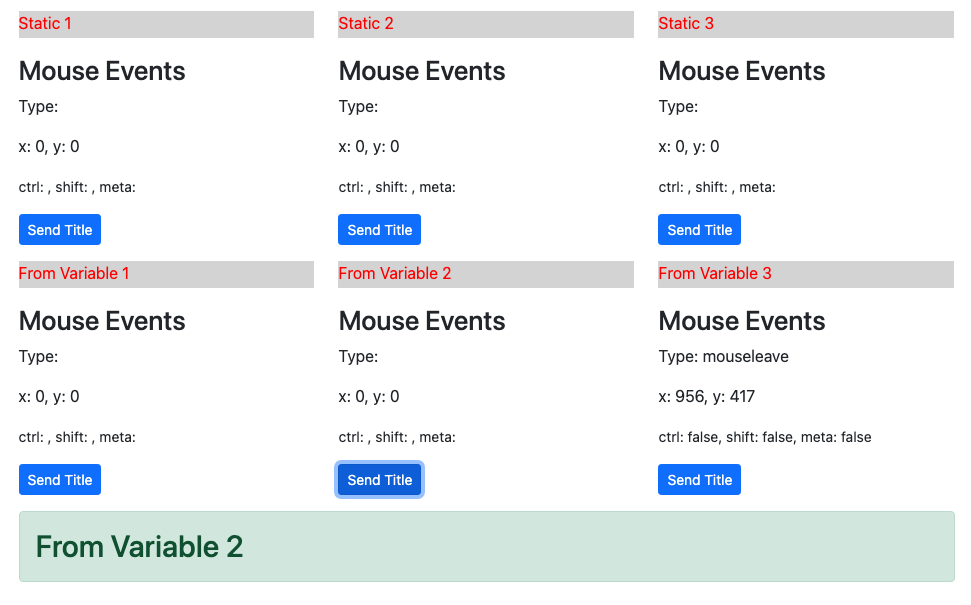

The `MyFirstComponent` appears six times. Three times in one row. A click on a _Send Title_ button updates the green box with the related title.

## Create an own Service

```sh
ng generate service services/todo
```

In the folder app/services add to the `todo.service.ts` file the typescript code:

```typescript
import { environment } from '../../environments/environment';
import { Injectable } from '@angular/core';
import { HttpClient } from '@angular/common/http';
import { Observable } from 'rxjs';
import { TodoItemListsDTO } from '../openapi-gen';

@Injectable({
  providedIn: 'root',
})
export class TodoService {
  private baseUrl: string;
  constructor(private http: HttpClient) {
    this.baseUrl = environment.API_BASE_PATH;
  }

  getListIDs(): Observable<TodoItemListsDTO> {
    return this.http.get(this.baseUrl + '/api/v1/listids');
  }
}
```

### Test the service - Option 1: with the real Backend

The TestBed is the most important of the Angular testing utilities.
The TestBed creates a dynamically-constructed Angular test module that emulates an Angular @NgModule.
The TestBed.configureTestingModule() method takes a metadata object that can have most of the properties of an @NgModule.
To test a service, you set the providers metadata property with an array of the services that you'll test or mock.

Add to the `todo.service.spec.ts` file the typescript code:

```typescript
import { TestBed } from '@angular/core/testing';

import { TodoService } from './todo.service';
import {
  provideHttpClient,
  withInterceptorsFromDi,
} from '@angular/common/http';
import { firstValueFrom } from 'rxjs';
import { importProvidersFrom } from '@angular/core';
import {
  ApiModule,
  BASE_PATH,
  TodoItemControllerService,
} from '../openapi-gen';
import { environment } from '../../environments/environment';

describe('TodoService with real Backend', () => {
  let ownTodoService: TodoService;
  let openApiTodoService: TodoItemControllerService;

  beforeEach(async () => {
    TestBed.configureTestingModule({
      imports: [],
      providers: [
        TodoService,
        TodoItemControllerService,
        provideHttpClient(withInterceptorsFromDi()),
        importProvidersFrom(ApiModule),
        {
          provide: BASE_PATH,
          useValue: environment.API_BASE_PATH,
        },
      ],
    });
    ownTodoService = TestBed.inject(TodoService);
    openApiTodoService = TestBed.inject(TodoItemControllerService);
  });

  it('should be created', () => {
    expect(ownTodoService).toBeTruthy();
  });

  it('should call the real backend for getListIDs from own Service', async () => {
    const data = await firstValueFrom(ownTodoService.getListIDs());
    console.log('data.count', data.count);
    expect(data.count).toBe(data.todoItemList?.length);
  });

  it('should call the real backend for getListIDs from OpenApi', async () => {
    const data = await firstValueFrom(openApiTodoService.getListIDs());
    console.log('data.count', data.count);
    expect(data.count).toBe(data.todoItemList?.length);
  });
});
```

The test is calling the real backend through the own TodoService and also
through the generated OpenApi service.

We can run the test through:

```shell
npm run test
```

### Test the service - Option 2: with a Mock Backend

One of the interesting additions that came about with the HttpClient in Angular is the HttpClientTestingModule.

Using that module, one can fully (unit)test a component or a service without using an actual
server implementation to handle HTTP requests from the Angular application.

```typescript
getListIDs(): Observable<TodoItemListsDTO> {
  return this.http.get(this.baseUrl + '/api/v1/listids');
}
```

The above method uses the HttpClient to fetch some data from a server.
We would like to write a test that makes sure that the task is handled properly.
Our basic expectations would look like this:

```typescript
const data = await firstValueFrom(ownTodoService.getListIDs());
expect(data.count).toBe(data.todoItemList?.length);
expect(data.count).toBe(2);
expect(data.todoItemList?.length).toBe(2);
```

Now if we just use the actual service as is, it is going to make an HTTP request to the server.
What we’re going to do instead is replace it with a **mocked version** provided by the `HttpClientTestingModule`:

```typescript
beforeEach(() => {
  TestBed.configureTestingModule({
    providers: [TodoService],
    imports: [HttpClientTestingModule],
  });
});
```

The above code uses the Angular TestBed to configure our environment under test,
which is going to use the HttpClientTestingModule instead of the regular HttpClientModule.

Once we have done that, we can inject a reference to a HttpTestingController,
which will allow us to control the behavior of our mocked HttpClient,
by setting expectations and returning fake data for testing purposes.

You can study the code of the unit test:

```typescript
import { TestBed } from '@angular/core/testing';

import { TodoService } from './todo.service';
import {
  HttpTestingController,
  provideHttpClientTesting,
} from '@angular/common/http/testing';
import {
  provideHttpClient,
  withInterceptorsFromDi,
} from '@angular/common/http';
import { importProvidersFrom } from '@angular/core';
import {
  ApiModule,
  BASE_PATH,
  TodoItemControllerService,
  TodoItemListsDTO,
} from '../openapi-gen';
import { environment } from '../../environments/environment';

describe('TodoService with Mock', () => {
  let ownTodoService: TodoService;
  let openApiTodoService: TodoItemControllerService;
  let httpMock: HttpTestingController;
  let baseUrl: string;

  beforeEach(async () => {
    TestBed.configureTestingModule({
      imports: [],
      providers: [
        TodoService,
        importProvidersFrom(ApiModule),
        {
          provide: BASE_PATH,
          useValue: environment.API_BASE_PATH,
        },
        provideHttpClient(withInterceptorsFromDi()),
        provideHttpClientTesting(),
      ],
    });
    ownTodoService = TestBed.inject(TodoService);
    openApiTodoService = TestBed.inject(TodoItemControllerService);
    httpMock = TestBed.inject(HttpTestingController);
    baseUrl = environment.API_BASE_PATH;
  });

  afterEach(() => {
    httpMock.verify();
  });

  it('should be created', () => {
    expect(ownTodoService).toBeTruthy();
    expect(openApiTodoService).toBeTruthy();
  });

  it('should call the mock backend for getListIDs from own service', async () => {
    ownTodoService.getListIDs().subscribe(data => {
      console.log('data.count', data.count);
      expect(data.count).toBe(data.todoItemList?.length);
    });
    const req = httpMock.expectOne(baseUrl + '/api/v1/listids');
    expect(req.request.method).toEqual('GET');
    // Then we set the fake data to be returned by the mock
    const todoList: TodoItemListsDTO = {
      count: 2,
      todoItemList: [
        '083e8820-0186-4c68-af01-af2ced91805a',
        '1da5ba97-4365-4560-bb23-2335f099288e',
      ],
    };
    req.flush(todoList);
  });

  it('should call the mock backend for getListIDs from OpenApi service', async () => {
    openApiTodoService.getListIDs().subscribe(data => {
      console.log('data.count', data.count);
      expect(data.count).toBe(data.todoItemList?.length);
    });
    const req = httpMock.expectOne(baseUrl + '/api/v1/listids');
    expect(req.request.method).toEqual('GET');
    // Then we set the fake data to be returned by the mock
    const todoList: TodoItemListsDTO = {
      count: 2,
      todoItemList: [
        '083e8820-0186-4c68-af01-af2ced91805a',
        '1da5ba97-4365-4560-bb23-2335f099288e',
      ],
    };
    req.flush(todoList);
  });
});
```

We can run the test through:

```shell
npm run test
```

## Create the TodoLists component

The `TodoListsComponent` is responsible for:

1. Fetching and displaying a list of to-do item lists.
2. Providing navigation to individual to-do list details when a list is
   clicked or the "Enter" key is pressed.
3. Creating new to-do lists and updating existing lists.
4. Deleting to-do lists.

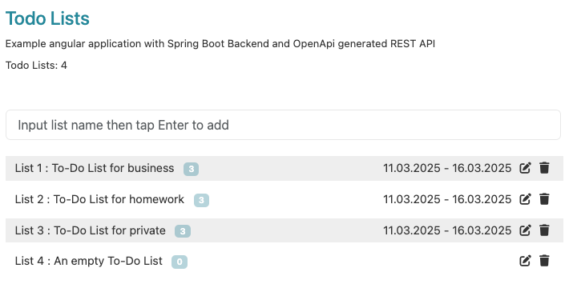


**Key Features**

- **Service Abstraction**: Allows switching between custom service and OpenAPI service for fetching data.
- **Unsubscription**: Prevents memory leaks by unsubscribing from observables during cleanup.
- **Accessibility**: Supports keyboard navigation for enhanced usability.
- **Dynamic Navigation**: Uses Angular's Router to navigate to individual to-do list details.

```sh
ng generate component TodoLists
```

The backend is providing us with the following api endpoints: 

- `GET /api/v1/listnames`: Fetches all to-do list names.
- `POST /api/v1/listnames`: Creates a new to-do list.
- `PUT /api/v1/listnames/{listId}`: Updates an existing to-do list.
- `DELETE /api/v1/listnames/{listId}`: Deletes a to-do list.
- `GET /api/v1/listitems/{listId}`: Fetches all to-do items for a specific list.


The `TodoListsComponent` will use the `TodoListNameControllerService` to interact with the backend.


Add to the `todo-lists.component.scss` file the rules:

```scss
.legend .row:nth-of-type(odd) div {
  background-color: #eeeeee;
}

.clickable:hover {
  box-shadow:
    0 0 1px 1px rgba(0, 0, 0, 0.19),
    0 0 3px 3px rgba(0, 0, 0, 0.19);
  cursor: pointer;
}

.todo-list-name-row {
  font-size: 0.9em;
}

.float-right {
  padding-left: 5px;
  padding-right: 5px;
  float: right;
}

.badge {
  background-color: rgba(34, 136, 153, 0.36);
  color: white;
  padding: 3px 6px;
  text-align: center;
  border-radius: 5px;
}


.form-control {
  font-size: 16px;
  padding-left: 15px;
  outline: none;
  border: 1px solid #e8e8e8;
}


```

Add to the `todo-lists.component.ts` file the typescript code:

```typescript
import {Component, ElementRef, OnDestroy, OnInit, ViewChild} from '@angular/core';
import {Subscription} from 'rxjs';
import {
  TodoItem,
  TodoItemControllerService,
  TodoItemListsDTO, TodoListName,
  TodoListNameControllerService,
  TodoListNameDTO
} from '../openapi-gen';
import {TodoService} from '../services/todo.service';
import {Router, RouterLink} from '@angular/router';
import {DatePipe} from '@angular/common';
import {ClickStopPropagation} from '../shared/directive/click-stop-propagation.directive';
import {KeydownStopPropagationDirective} from '../shared/directive/keydown-stop-propagation.directive';
import {getUUID} from '../shared/utils';

@Component({
  selector: 'app-todo-lists',
  templateUrl: './todo-lists.component.html',
  styleUrls: ['./todo-lists.component.scss'],
  imports: [RouterLink, DatePipe, ClickStopPropagation, KeydownStopPropagationDirective],
})
export class TodoListsComponent implements OnInit, OnDestroy {
  @ViewChild('listNameTextField', { static: false }) listNameTextField: ElementRef<HTMLInputElement> | undefined;
  private todoListNamesSubscription: Subscription | undefined;
  todoListNames: TodoListNameDTO[] = [];
  editIndex = -1;

  constructor(
    private readonly todoItemControllerService: TodoItemControllerService,
    private readonly todoListNameControllerService: TodoListNameControllerService,
    private readonly todoService: TodoService,
    private readonly router: Router
  ) {
  }

  ngOnDestroy(): void {

    if (this.todoListNamesSubscription != undefined) {
      this.todoListNamesSubscription.unsubscribe();
    }
  }

  ngOnInit(): void {
    this.refreshList();
  }

  refreshList(): void {

    this.todoListNamesSubscription = this.todoListNameControllerService.getAllTodoListNames().subscribe({
      next: data => (this.todoListNames = data),
      error: err => console.log(err),
    });
  }

  onEnterKeyDownField() {
    const inputField = this.listNameTextField?.nativeElement;
    if (!inputField) return;

    const listName = inputField.value.trim();
    if (!listName) return;

    const isEditing = this.editIndex >= 0;
    const existingList = isEditing ? this.todoListNames[this.editIndex] : null;

    const todoListName: TodoListName = {
      id: existingList?.listId ?? getUUID(),
      name: listName,
    };

    const request$ = isEditing
      ? this.todoListNameControllerService.updateTodoListName(todoListName.id, todoListName)
      : this.todoListNameControllerService.createTodoListName(todoListName);

    request$.subscribe({
      next: () => this.refreshList(),
      error: console.error,
    });

    if (isEditing) this.editIndex = -1;
    inputField.value = '';
  }

  onEnterKeyDownList(listId: string | undefined) {
    this.router.navigate(['/todoitem/', listId]);
  }

  onDelete(listId: string | undefined) {
    if (listId !== undefined) {
      this.todoListNameControllerService.deleteTodoListName(listId).subscribe({
        next: () => this.refreshList(),
        error: err => console.log(err),
      });
    }
  }

  onEdit(index: number) {
    if (this.listNameTextField !== undefined && this.todoListNames[index] !== undefined && this.todoListNames[index].listName !== undefined) {
      this.listNameTextField.nativeElement.value = this.todoListNames[index].listName;
      this.editIndex = index;
    }
  }

}

```

**TodoListsComponent Explanation**

**Overview**
The `TodoListsComponent` is an Angular component responsible for managing and displaying a list of To-Do lists. It allows users to create, edit, delete, and navigate to individual To-Do lists.

**Imports**

The component imports various Angular and custom dependencies:
- **Core Angular Modules:** `Component`, `ElementRef`, `OnDestroy`, `OnInit`, `ViewChild`.
- **RxJS:** `Subscription` for managing observable subscriptions.
- **OpenAPI Generated Services:** `TodoItemControllerService`, `TodoListNameControllerService`, DTOs for interacting with the backend.
- **Services:** `TodoService` for additional logic.
- **Routing:** `Router` and `RouterLink` for navigation.
- **Directives:** `ClickStopPropagation`, `KeydownStopPropagationDirective` for handling event propagation.
- **Utilities:** `getUUID()` for generating unique identifiers.

**Component Decorator**

- Defines the selector `app-todo-lists` for use in templates.
- Specifies associated HTML and CSS files.
- Declares imported modules and directives.

**Class Properties**
```typescript
@ViewChild('listNameTextField', { static: false })
listNameTextField: ElementRef<HTMLInputElement> | undefined;
```
- Retrieves a reference to the input field for entering a new To-Do list name.
- `todoListNamesSubscription`: Holds the subscription for fetching To-Do list names.
- `todoListNames`: Stores the retrieved list names.
- `editIndex`: Tracks the index of a list being edited.


**Lifecycle Hooks**

`ngOnInit`

```typescript
ngOnInit(): void {
  this.refreshList();
}
```
- Calls `refreshList()` to fetch and display the To-Do lists when the component initializes.

`ngOnDestroy`
```typescript
ngOnDestroy(): void {
  if (this.todoListNamesSubscription != undefined) {
    this.todoListNamesSubscription.unsubscribe();
  }
}
```
- Unsubscribes from the observable to prevent memory leaks when the component is destroyed.

**Methods**

`refreshList()`

- Fetches all To-Do list names from the API and updates `todoListNames`.
- Logs errors to the console.

`onEnterKeyDownField()`

- Handles pressing the Enter key in the input field.
- Creates or updates a To-Do list based on `editIndex`.
- Refreshes the list after API request completion.

`onEnterKeyDownList(listId: string | undefined)`

- Navigates to the `todo-items` page of a selected list when Enter is pressed.

`onDelete(listId: string | undefined)`
- Deletes a To-Do list and refreshes the list after a successful API call.

`onEdit(index: number)`

- Enables editing mode by setting `editIndex` and populating the input field with the selected list name.

**Summary**
- **Displays** a list of To-Do lists.
- **Allows** users to add, edit, delete, and navigate to To-Do lists.
- **Utilizes** API services to interact with the backend.
- **Implements** event handling for keypresses and button clicks.
- **Manages** subscriptions to avoid memory leaks.


Add to the `todo-lists.component.html` file the template code:

```html
<h4 class="component-title">Todo Lists</h4>
<p class="sub-para todo-info">Example angular application with Spring Boot Backend and OpenApi generated REST API</p>
<p class="sub-para todo-listinfo">Todo Lists: {{ todoListNames.length }}</p>


<div class="container" style="padding-left: 0">
  <div class="row">
    <div class="col-sm-9 my-3 pe-0">
      <input
        type="text"
        id="listNameTextField"
        tabIndex="1"
        #listNameTextField
        class="form-control"
        (keydown.enter)="onEnterKeyDownField()"
        placeholder="Input list name then tap Enter to add"/>
    </div>
  </div>
</div>
<section class="container legend todo-list-name-row">
  @for (row of todoListNames; track row.listId; let i = $index) {
  <div class="row">
    <div class="col-sm-9 py-1 my-1 clickable"
         [routerLink]="['/todoitem/', row.listId] ">
        <span
          tabindex=-1
          (keydown.enter)="onEnterKeyDownList(row.listId)">
              List {{ i + 1 }}
          <span role="link"
                tabindex="{{ i * 3 + 1 }}">
                    : {{ row.listName }} &nbsp;
          </span>
          <span class="badge">
                {{ row.count }}
          </span>

          <!-- eslint-disable -->
        <span (click)="onDelete(row.listId)" clickStopPropagation
              (keydown.enter)="onEdit(i)" keydownStopPropagation
              role="button"
              tabindex="{{ i * 3 + 4 }}"
              class="float-right">
              <i class="fa fa-trash"></i>
          </span>

        <span (click)="onEdit(i)" clickStopPropagation
              (keydown.enter)="onEdit(i)" keydownStopPropagation
              role="button"
              tabindex="{{ i * 3 + 3 }}"
              class="float-right">
              <i class="fa fa-edit"></i>
          </span>
          <!-- eslint-enable -->
        <span class="float-right"
              tabindex=-1
              [routerLink]="['/todoitem/', row.listId]">
              {{ row.fromDate | date: 'dd.MM.yyyy' }}
          @if (row.count && row.count > 0) {
            -
          }
          {{ row.toDate | date: 'dd.MM.yyyy' }}
          </span>
        </span>
    </div>
  </div>
  }
</section>

```

Instead of using `*ngFor`the new flow syntax with `@for` can be used:

```html
@for (listId of todoLists.todoItemList; track listId; let i = $index) { ... }
```

**Code Explanation**

Explanation of the Angular Template: 
This Angular template represents a To-Do List UI that interacts with a Spring Boot 
backend using an OpenAPI-generated REST API. 
It dynamically displays a list of to-do lists and provides functionalities for creating, editing, 
and deleting them.

1. **Header Section**:
   - Displays a title ("Todo Lists").
   - Shows a description of the application.
   - Displays the total number of to-do lists using Angular interpolation ({{ todoListNames.length }}).

2. **Input Field for Creating a New To-Do List**
    - Provides an input field (<input>) where users can type the name of a new to-do list.
    - The field triggers the onEnterKeyDownField() method when the Enter key is pressed.
    - The keydown.enter event triggers onEnterKeyDownField(), which  adds a new list when the Enter key is pressed.

3. **Displaying the To-Do Lists**

    - Uses the @for directive (Angular's new template syntax) to iterate over todoListNames.
    - Each to-do list (row) is displayed inside a `<div class="row">`.
    - [routerLink] navigates to a details page for the specific to-do list (/todoitem/{listId}) when clicked.

4. **Delete and Edit Buttons**
    - Trash icon (fa-trash): Calls onDelete(row.listId) to delete the list.
    - Edit icon (fa-edit): Calls onEdit(i) to edit the list.
    - click-stop-propagation prevents event bubbling, so clicking these icons doesn't trigger other parent elements' click events.

#### Unit Tests for the TodoLists component

Add some unit tests to the file `todo-lists.component.spec.ts` file and add the following typescript code:

```typescript
import { TestBed } from '@angular/core/testing';
import { AppComponent } from './app.component';
import { RouterTestingHarness } from '@angular/router/testing';
import { TodoListsComponent } from './todo-lists/todo-lists.component';
import { RouterModule } from '@angular/router';
import {ApiModule, BASE_PATH, TodoItemControllerService, TodoItemListsDTO, TodoListNameDTO} from './openapi-gen';
import { provideHttpClient, withInterceptorsFromDi } from '@angular/common/http';
import { importProvidersFrom } from '@angular/core';
import { environment } from '../environments/environment';
import {HttpTestingController, provideHttpClientTesting, TestRequest} from '@angular/common/http/testing';

describe('AppComponent', () => {
  let httpMock: HttpTestingController;
  let baseUrl: string;

  beforeEach(async () => {
    await TestBed.configureTestingModule({
      imports: [
        AppComponent,
        RouterModule.forRoot([
          { path: 'home', component: TodoListsComponent },
          { path: '', component: TodoListsComponent },
        ]),
      ],
      providers: [
        TodoItemControllerService,
        provideHttpClient(withInterceptorsFromDi()),
        importProvidersFrom(ApiModule),
        {
          provide: BASE_PATH,
          useValue: environment.API_BASE_PATH,
        },
        provideHttpClientTesting(),
      ],
    }).compileComponents();
    httpMock = TestBed.inject(HttpTestingController);
    baseUrl = environment.API_BASE_PATH;
  });

  afterEach(() => {
    httpMock.verify();
  });

  it('should create the app', () => {
    const fixture = TestBed.createComponent(AppComponent);
    const app = fixture.componentInstance;
    expect(app).toBeTruthy();
  });

  it(`should have as title 'todo-angular'`, () => {
    const fixture = TestBed.createComponent(AppComponent);
    const app = fixture.componentInstance;
    expect(app.title).toEqual('todo-angular');
  });

  it('should render title', () => {
    const fixture = TestBed.createComponent(AppComponent);
    fixture.detectChanges();
    const compiled = fixture.nativeElement;
    expect(compiled.querySelector('.navbar-brand').textContent).toContain('Todo App');
  });

  it('should navigate to home and display TodoListsComponent', async () => {
    const harness = await RouterTestingHarness.create();
    // Navigate to the route to get your component
    const activatedComponent = await harness.navigateByUrl('/', TodoListsComponent);
    const reqListNames = httpMock.expectOne(baseUrl + '/api/v1/todolist-names');
    expect(reqListNames.request.method).toEqual('GET');

    const todoList: TodoItemListsDTO = {
      count: 2,
      todoItemList: ['083e8820-0186-4c68-af01-af2ced91805a', '1da5ba97-4365-4560-bb23-2335f099288e'],
    };
    const todoListNames: TodoListNameDTO[] = [
      {
        count: 3,
        listId: "da2c63f8-b414-46fb-8ae9-c54c1e5c0f00",
        fromDate: "2025-03-11T08:27:45.741982Z",
        toDate: "2025-03-16T08:27:45.741990Z",
        listName: "To-Do List for business"
      },
      {
        count: 3,
        listId: "2f9c96e1-51ab-47b5-aec9-30980eef61c0",
        fromDate: "2025-03-11T08:27:45.750231Z",
        toDate: "2025-03-16T08:27:45.750234Z",
        listName: "To-Do List for homework"
      }
    ];

    reqListNames.flush(todoListNames);

    // await new Promise(resolve => setTimeout(resolve, 500)); // 500 ms
    expect(activatedComponent.todoListNames).toBe(todoListNames);
  });
});

```

**Explanation of the unit test**


Here’s an explanation of your unit test:

**Overview**
The test suite verifies the behavior of the TodoListsComponent, an Angular component that manages to-do lists. It uses Jasmine as the testing framework and Angular's TestBed for setting up the test environment.

**Test Setup**

- Mock Services: TodoListNameControllerService: Handles CRUD operations on to-do lists.
- Router: Used for navigation.

These services are replaced with Jasmine spies (jasmine.createSpyObj), allowing us to track method calls and return mock responses.

- Component Initialization: TestBed.configureTestingModule() is used to declare and provide dependencies.
- createComponent(TodoListsComponent) initializes the component.

**Test Cases**

1. **Component Creation:**

- Ensures the component initializes successfully.

2. **Fetching To-Do List Names (ngOnInit):**

- Mocks the getAllTodoListNames() method to return a sample list.
- Calls ngOnInit() and verifies that todoListNames contains the expected data.

3. **Adding a New To-Do List (onEnterKeyDownField):**

  - Mocks the text field input.
  - Mocks createTodoListName() to return a successful response.
  - Calls onEnterKeyDownField() and verifies the service method was called.

4. **Editing an Existing To-Do List (onEnterKeyDownField):**

- Sets an editIndex to simulate editing.
- Mocks updateTodoListName() with a response.
- Calls onEnterKeyDownField() and verifies the update request was sent.

5. **Navigating to a To-Do List (onEnterKeyDownList):**

- Calls onEnterKeyDownList() and verifies Router.navigate() was triggered.

6. **Deleting a To-Do List (onDelete):**

- Mocks deleteTodoListName() with a response.
- Calls onDelete() and verifies that the method was called with the correct ID.


#### Alternative Unit Tests for the TodoLists component

The code tests the `TodoListsComponent of an Angular application using the
Angular TestBed and the HTTP testing utilities provided by Angular.
It checks that the component initializes correctly and verifies its
behavior when interacting with a mock HTTP service.

Create the file `todo-lists-httpmock.component.spec.ts` file and add the following typescript code:

```typescript
import { ComponentFixture, TestBed } from '@angular/core/testing';

import { TodoListsComponent } from './todo-lists.component';
import { HttpTestingController, provideHttpClientTesting } from '@angular/common/http/testing';
import { provideHttpClient, withInterceptorsFromDi } from '@angular/common/http';
import {
  ApiModule,
  BASE_PATH,
  TodoItemControllerService,
  TodoItemListsDTO,
  TodoListName,
  TodoListNameDTO
} from '../openapi-gen';
import { importProvidersFrom } from '@angular/core';
import { environment } from '../../environments/environment';

describe('TodoListsComponent Test with http mock', () => {
  let component: TodoListsComponent;
  let fixture: ComponentFixture<TodoListsComponent>;
  let httpMock: HttpTestingController;
  let baseUrl: string;

  beforeEach(async () => {
    await TestBed.configureTestingModule({
      imports: [TodoListsComponent],
      providers: [
        TodoItemControllerService,
        provideHttpClient(withInterceptorsFromDi()),
        importProvidersFrom(ApiModule),
        { provide: BASE_PATH, useValue: environment.API_BASE_PATH },
        provideHttpClientTesting(),
      ],
    }).compileComponents();
    httpMock = TestBed.inject(HttpTestingController);
    baseUrl = environment.API_BASE_PATH;
    fixture = TestBed.createComponent(TodoListsComponent);
    component = fixture.componentInstance;
    fixture.detectChanges();
  });

  it('should create', () => {
    expect(component).toBeTruthy();
  });

  it('should  display TodoListsComponent with 3 items', async () => {
    const req = httpMock.expectOne(baseUrl + '/api/v1/todolist-names');
    expect(req.request.method).toEqual('GET');
    // Then we set the fake data to be returned by the mock
    const todoList: TodoListNameDTO[] = [
      {
        "count": 3,
        "listId": "da2c63f8-b414-46fb-8ae9-c54c1e5c0f00",
        "fromDate": "2025-03-11T08:27:45.741982Z",
        "toDate": "2025-03-16T08:27:45.741990Z",
        "listName": "To-Do List for business"
      },
      {
        "count": 3,
        "listId": "2f9c96e1-51ab-47b5-aec9-30980eef61c0",
        "fromDate": "2025-03-11T08:27:45.750231Z",
        "toDate": "2025-03-16T08:27:45.750234Z",
        "listName": "To-Do List for homework"
      },
      {
        "count": 3,
        "listId": "2e45aace-3823-413e-a145-0cab9cc7a115",
        "fromDate": "2025-03-11T08:27:45.753923Z",
        "toDate": "2025-03-16T08:27:45.753927Z",
        "listName": "To-Do List for private"
      }
    ]

    req.flush(todoList);
    // await new Promise(resolve => setTimeout(resolve, 500)); // 500 ms
    console.log('TodoListComponent.todoLists.count', component.todoListNames.length);

  });
});

```

We can run the test through:

```shell
npm run test
```

**Code Explanation**

The above unit test code uses the Angular `TestBed` to configure our environment under test,
which is going to use the `HttpClientTestingModule` instead of the regular `HttpClientModule`.
The fake `TodoList` contains 3 todoItems with a count of 3.

1. **Setup**

  - `TestBed.configureTestingModule` sets up the test environment with:

    - `TodoListsComponent` as the component under test.
    - The `TodoItemControllerService` and `ApiModule` for handling HTTP-related operations.
    - `BASE_PATH` configured with the `API_BASE_PATH` from the environment file.
    - HTTP testing utilities to mock requests and responses.

  - After configuring the module, `HttpTestingController` is injected to control and verify HTTP requests during tests.

  - A `ComponentFixture` for the `TodoListsComponent` is created, allowing interaction with the component instance and DOM.

2. **Test 1: Component Creation**

  - The first test case simply verifies that the component is created and initialized without errors.

3. **Test 2: Mocking HTTP Requests**

  - A GET request to `/api/v1/listids` is expected. This is verified using `httpMock.expectOne`.
  - The mock response (`todoList`) is defined and returned using `req.flush(todoList)`.
  - Assertions check:
    - The number of todo items (count) in the component matches the mock response.
    - The todo item IDs in the component match the mock response.

## Display the TodoLists Component through the Router

To make the `TodoList` component work, we need to include it in the `app.component.html` file.
First, delete the existing generated content, and then replace it with the following:

```html
<router-outlet></router-outlet>
```

### Define the routings for TodoListsComponent

The file `app.routes.ts` can be used to configure the router:

```typescript
import { Routes } from '@angular/router';
import { TodoListsComponent } from './todo-lists/todo-lists.component';

export const routes: Routes = [
  {
    path: 'home',
    component: TodoListsComponent,
  },
  {
    path: '',
    pathMatch: 'full',
    redirectTo: '/home',
  },
];
```

The router redirects the default route to `/home` and loads the `TodoListComponent`
into the `<router-outlet></router-outlet>`.

## Adapt the App Component for displaying the TodoListComponent

We can delete all unnecessary code from AppComponent:

```typescript
import { Component } from '@angular/core';
import { RouterOutlet } from '@angular/router';

@Component({
  selector: 'app-root',
  imports: [RouterOutlet],
  templateUrl: './app.component.html',
  styleUrl: './app.component.scss',
})
export class AppComponent {}
```

We can start the application and should see the following.

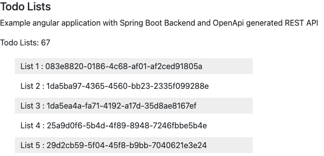

#### Unit Test for the App component

We can add a unit test for `AppComponent` which is navigating
through the `RouterTestingHarness` to load the TodoListComponent.
We are using the `HttpClientTestingModule` to Mock the call to the backend.
We are loading 2 todo items.

```typescript
import { TestBed } from '@angular/core/testing';
import { AppComponent } from './app.component';
import { RouterTestingHarness } from '@angular/router/testing';
import { TodoListsComponent } from './todo-lists/todo-lists.component';
import { RouterModule } from '@angular/router';
import {
  ApiModule,
  BASE_PATH,
  TodoItemControllerService,
  TodoItemListsDTO,
} from './openapi-gen';
import {
  provideHttpClient,
  withInterceptorsFromDi,
} from '@angular/common/http';
import { importProvidersFrom } from '@angular/core';
import { environment } from '../environments/environment';
import {
  HttpTestingController,
  provideHttpClientTesting,
} from '@angular/common/http/testing';

describe('AppComponent', () => {
  let httpMock: HttpTestingController;
  let baseUrl: string;

  beforeEach(async () => {
    await TestBed.configureTestingModule({
      imports: [
        AppComponent,
        RouterModule.forRoot([
          { path: 'home', component: TodoListsComponent },
          { path: '', component: TodoListsComponent },
        ]),
      ],
      providers: [
        TodoItemControllerService,
        provideHttpClient(withInterceptorsFromDi()),
        importProvidersFrom(ApiModule),
        {
          provide: BASE_PATH,
          useValue: environment.API_BASE_PATH,
        },
        provideHttpClientTesting(),
      ],
    }).compileComponents();
    httpMock = TestBed.inject(HttpTestingController);
    baseUrl = environment.API_BASE_PATH;
  });

  afterEach(() => {
    httpMock.verify();
  });

  it('should create the app', () => {
    const fixture = TestBed.createComponent(AppComponent);
    const app = fixture.componentInstance;
    expect(app).toBeTruthy();
  });

  it('should navigate to home and display TodoListsComponent', async () => {
    const harness = await RouterTestingHarness.create();
    // Navigate to the route to get your component
    const activatedComponent = await harness.navigateByUrl(
      '/',
      TodoListsComponent
    );
    const req = httpMock.expectOne(baseUrl + '/api/v1/listids');
    expect(req.request.method).toEqual('GET');
    // Then we set the fake data to be returned by the mock
    const todoList: TodoItemListsDTO = {
      count: 2,
      todoItemList: [
        '083e8820-0186-4c68-af01-af2ced91805a',
        '1da5ba97-4365-4560-bb23-2335f099288e',
      ],
    };
    req.flush(todoList);
    // await new Promise(resolve => setTimeout(resolve, 500)); // 500 ms
    console.log(
      'AppComponent.activatedComponent.todoLists.count',
      activatedComponent.todoLists.count
    );
    expect(activatedComponent.todoLists.count).toBe(todoList.count);
    expect(activatedComponent.todoLists.todoItemList).toBe(
      todoList.todoItemList
    );
  });
});
```

**Code Explanation**

This unit test checks the functionality of the AppComponent in an Angular application.
It uses Angular's testing utilities and HTTP mocking to validate application behavior.

Here's a detailed explanation of the code:

1. **Test Setup**

  - **Imports**:

    - `AppComponent`: The component under test.
    - `RouterModule.forRoot`: Sets up routing with two routes (`/home` and `/`), both pointing to `TodoListsComponent`.

  - **Providers**:

    - `TodoItemControllerService`: Service for interacting with the API.
    - `provideHttpClient(withInterceptorsFromDi())`: Configures the HTTP client with interceptors.
    - `importProvidersFrom(ApiModule)`: Imports the `ApiModule` for API integration.
    - `BASE_PATH`: Provides the base API path from the environment configuration.
    - `provideHttpClientTesting()`: Sets up HTTP client testing utilities.

2. **Test Cases**

  - **App Creation Test**
  - **Navigation and API Interaction Test**
    - Tests routing to `/` and API response handling in `TodoListsComponent`.
    - **Step 1: Navigate to Route**. `RouterTestingHarness`: Simulates routing and retrieves the component rendered at a route (`TodoListsComponent` for `/`).
    - **Step 2: Mock API Request**. Expects a GET request to `/api/v1/listids`. Asserts the request method is GET.
    - **Step 3: Provide Fake API Response**. Provides mock response data (`todoList`) to the intercepted API request.
    - **Step 4: Validate Component Data**. Logs and verifies that the `TodoListsComponent` correctly receives and handles the API response data.

We can run the test through:

```shell
npm run test
```


## Create the TodoItems component

We want to display a list with TodoItems.

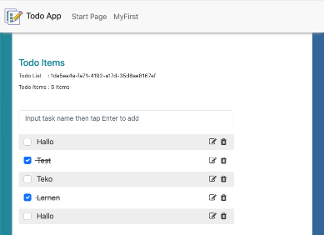

Every click to an icon or check box requires an interaction with the backend.
The description of the Api can be found here:

https://todo-h2.united-portal.com/swagger-ui.html (Open Api Frontend)

| Description                 | Method | Link                  |
| --------------------------- | ------ | --------------------- |
| Load a list with Todo Items | GET    | /api/v1/list/{listId} |
| Create a Todo Item          | POST   | /api/v1/new           |
| Save a Todo Item            | PUT    | /api/v1/edit/{id}     |
| Delete a Todo Item          | DELETE | /api/v1/delete/{id}   |
| Set the done state          | PUT    | /api/v1/state/{id}    |

All API Service calls are avalailable in the generated `TodoItemControllerService`.

We can generate a new `TodoItem` Component:

```sh
ng generate component TodoItems
```

This Angular 19 component, TodoItemsComponent, is designed to manage a todo list.
It interacts with a service to perform CRUD operations,
allowing the user to view, add, edit, and delete todo items.

Add to the `todo-items.component.scss` file the css rules:

```scss
.legend .row:nth-of-type(odd) div {
  background-color: #eeeeee;
}

.clickable:hover {
  box-shadow:
    0 0 1px 1px rgba(0, 0, 0, 0.19),
    0 0 3px 3px rgba(0, 0, 0, 0.19);
  cursor: pointer;
}

.cmd-buttons {
  padding-left: 5px;
  padding-right: 5px;
  float: right;
}
.cmd-buttons:hover {
  box-shadow:
    0 0 1px 1px rgba(0, 0, 0, 0.19),
    0 0 1px 1px rgba(0, 0, 0, 0.19);
}

.form-control {
  font-size: 16px;
  padding-left: 15px;
  outline: none;
  border: 1px solid #e8e8e8;
}
```

Add to the `todo-items.component.ts` file the typescript code:

```typescript
import { Component, ElementRef, OnInit, ViewChild, OnDestroy } from '@angular/core';
import { Subscription } from 'rxjs';
import { TodoItem, TodoItemControllerService } from '../openapi-gen';
import { ActivatedRoute } from '@angular/router';
import { parseIsoDateStrToDate } from '../shared/utils';
import {DatePipe, NgStyle} from '@angular/common';

@Component({
  selector: 'app-todo-items',
  templateUrl: './todo-items.component.html',
  styleUrls: ['./todo-items.component.scss'],
  imports: [NgStyle, DatePipe],
})
export class TodoItemsComponent implements OnInit, OnDestroy {
  @ViewChild('taskNameTextField', { static: false }) taskNameTextField: ElementRef<HTMLInputElement> | undefined;
  private routeSubscription: Subscription | undefined;
  private subscription: Subscription | undefined;
  listId = '';
  todoItems: TodoItem[] = [];
  private editIndex = -1;

  constructor(
    private readonly todoItemControllerService: TodoItemControllerService,
    private route: ActivatedRoute
  ) {}

  ngOnDestroy(): void {
    if (this.routeSubscription != undefined) {
      this.routeSubscription.unsubscribe();
    }
    if (this.subscription != undefined) {
      this.subscription.unsubscribe();
    }
  }

  ngOnInit(): void {
    this.routeSubscription = this.route.params.subscribe(params => {
      this.listId = params['id'];
      // console.log(this.listId);
      this.refreshList(this.listId);
    });
  }

  getListId(id: number): string | undefined {
    if (this.todoItems.length > 0) {
      return this.todoItems[id].listId;
    }
    return '';
  }

  onDelete(itemId: number | undefined) {
    if (itemId !== undefined) {
      this.todoItemControllerService.deleteTodoItem(itemId).subscribe({
        next: () => this.refreshList(this.listId),
        error: err => console.log(err),
      });
    }
  }

  onEdit(index: number) {
    if (this.taskNameTextField !== undefined) {
      this.taskNameTextField.nativeElement.value = this.todoItems[index].taskName;
      this.editIndex = index;
    }
  }

  onDone(itemId: number | undefined) {
    if (itemId !== undefined) {
      this.todoItemControllerService.changeDoneState(itemId).subscribe({
        next: () => this.refreshList(this.listId),
        error: err => console.log(err),
      });
    }
  }

  refreshList(listId: string) {
    this.subscription = this.todoItemControllerService.getItemsOfOneList(listId).subscribe({
      next: data => {
        this.todoItems = data;
        this.todoItems.forEach(item => (item.createdAt = parseIsoDateStrToDate(item.createdAt)));
        if (this.taskNameTextField !== undefined) {
          this.taskNameTextField.nativeElement.focus();
          this.taskNameTextField.nativeElement.select();
        }
      },
      error: err => console.log(err),
    });
  }

  onEnterKeyDown() {
    if (this.taskNameTextField !== undefined) {
      const taskName: string = this.taskNameTextField.nativeElement.value;
      if (taskName.length > 0) {
        if (this.editIndex >= 0) {
          this.todoItems[this.editIndex].taskName = taskName;
          this.todoItemControllerService.editTodoItem(this.todoItems[this.editIndex]).subscribe({
            next: () => this.refreshList(this.listId),
            error: err => console.log(err),
          });

          this.editIndex = -1;
        } else {
          const todoItem: TodoItem = {
            taskName: taskName,
            listId: this.listId,
            done: false,
          };
          this.todoItemControllerService.newTodoItem(todoItem).subscribe({
            next: () => this.refreshList(this.listId),
            error: err => console.log(err),
          });
        }
        this.taskNameTextField.nativeElement.value = '';
      }
    }
  }
}

```

**Explanation of Angular 19 TodoItemsComponent**

In `ngOnInit` is a `route.params` subscription to get the `listID` from the route URL:

| Description                 | Method                      |
| --------------------------- | --------------------------- |
| Load a list with Todo Items | refreshList(listId: string) |
| Create a Todo Item          | onEnterKeyDown()            |
| Save a Todo Item            | onEnterKeyDown()            |
| Delete a Todo Item          | onDelete(itemId: number)    |
| Set the done state          | onDone(itemId: number)      |
| Edit                        | onEdit(index: number)       |

1. **Component Lifecycle Hooks**

  - ngOnInit

    - Subscribes to route parameters to retrieve the listId.
    - Calls refreshList() to fetch the todo items for the list.

  - ngOnDestroy

    - Ensures subscriptions are unsubscribed to prevent memory leaks.

2. **Properties**

  - `taskNameTextField`

    - A reference to the input field for adding/editing tasks.

  - Subscriptions (`routeSubscription`, `subscription`)

    - Used to manage observables for route changes and service calls.

  - `listId`

    - Stores the current todo list's ID

  - `todoItems`

    - Holds the array of todo items fetched from the service.

  - `editIndex`

    - Tracks the index of the item being edited.

3. **Methods**

  - `refreshList(listId: string)`

    - Fetches the todo items for the given listId.
    - Converts item creation dates to JavaScript Date objects using parseIsoDateStrToDate.

  - `onEnterKeyDown()`

    - Handles adding or editing tasks when the Enter key is pressed.
    - Creates a new task if no item is being edited.
    - Updates an existing task if editIndex is set.

  - `onEdit(index: number)`

    - Prepares a task for editing by populating the input field with the task name and setting editIndex.

  - `onDelete(itemId: number | undefined)`

    - Deletes the task with the given ID by calling the service.

  - `onDone(itemId: number | undefined)`

    - Toggles the "done" state of a task by calling the service.

  - `getListId(id: number): string | undefined`

    - Retrieves the listId of the first todo item, or an empty string if the list is empty.

#### TodoItems HTML file

Add to the `todo-items.component.html` file the template code:

```html
<h4 class="component-title">Todo Items</h4>

<p class="sub-para todo-info">Todo List &nbsp;&nbsp; : {{ getListId(0) }}</p>
<p class="sub-para todo-listinfo">Todo Items : {{ todoItems.length }} Items</p>

<div class="container" style="padding-left: 0">
  <div class="row">
    <div class="col-sm-9 my-3 pe-0">
      <input
        type="text"
        id="taskNameTextField"
        tabIndex="1"
        #taskNameTextField
        class="form-control"
        (keydown.enter)="onEnterKeyDown()"
        placeholder="Input task name then tap Enter to add"/>
    </div>
  </div>
</div>
<section class="container legend">
  @for (todoItem of todoItems; track i; let i = $index) {
  <div class="row">
    <div class="col-sm-9 py-1 my-1 clickable">
      <input
        [checked]="todoItem.done"
        (click)="onDone(todoItem.itemId)"
        class="form-check-input"
        tabIndex="{{ i * 3 + 2 }}"
        type="checkbox"/>
      &nbsp;
      <span [ngStyle]="{ 'text-decoration': todoItem.done ? 'line-through' : 'none' }">
          {{ todoItem.taskName }}
        </span>
      <!-- eslint-disable -->
      <span (click)="onDelete(todoItem.itemId)"
            (keydown.enter)="onEdit(i)"
            role="button"
            tabIndex="{{ i * 3 + 4 }}"
            class="cmd-buttons">
          <i class="fa fa-trash"></i>
        </span>

      <span (click)="onEdit(i)"
            (keydown)="onEdit(i)"
            role="button"
            tabIndex="{{ i * 3 + 3 }}"
            class="cmd-buttons">
          <i class="fa fa-edit"></i>
        </span>
      <!-- eslint-enable -->
      <span class="cmd-buttons">
          {{todoItem.createdAt | date: 'dd.MM.yyyy'}}
        </span>
    </div>
  </div>
  }
</section>

```

Instead of using `*ngFor`the new flow syntax with `@for` can be used:

```html
@for (todoItem of todoItems; track i; let i = $index) { ... }
```

**Key Features**

1. **Dynamic Updates**

- The UI updates in real-time as tasks are added, edited, or removed.

2. **Focus Management**

- Automatically focuses on the input field after actions to improve usability.

3. **Reactive Design**

- Relies on RxJS for managing asynchronous operations like fetching and updating tasks.

4. **Error Handling**

- Errors during service calls are logged in the console.

#### TodoItem Unit Test

Add to the `todo-items.component.spec.ts` file the typescript code:

```typescript
import { ComponentFixture, TestBed } from '@angular/core/testing';
import { By } from '@angular/platform-browser';
import { TodoItemsComponent } from './todo-items.component';
import { TodoItem, TodoItemControllerService } from '../openapi-gen';
import { ActivatedRoute } from '@angular/router';
import { of } from 'rxjs';
import { FormsModule } from '@angular/forms';
import { importProvidersFrom } from '@angular/core';

describe('TodoItemsComponent', () => {
  let component: TodoItemsComponent;
  let fixture: ComponentFixture<TodoItemsComponent>;
  let mockTodoItemControllerService: jasmine.SpyObj<TodoItemControllerService>;
  let mockActivatedRoute: Partial<ActivatedRoute>;

  beforeEach(async () => {
    mockTodoItemControllerService = jasmine.createSpyObj(
      'TodoItemControllerService',
      [
        'deleteTodoItem',
        'changeDoneState',
        'getItem',
        'editTodoItem',
        'newTodoItem',
      ]
    );

    mockActivatedRoute = {
      params: of({ id: '123' }),
    };

    await TestBed.configureTestingModule({
      imports: [TodoItemsComponent],
      providers: [
        {
          provide: TodoItemControllerService,
          useValue: mockTodoItemControllerService,
        },
        { provide: ActivatedRoute, useValue: mockActivatedRoute },
        importProvidersFrom(FormsModule),
      ],
    }).compileComponents();

    fixture = TestBed.createComponent(TodoItemsComponent);
    component = fixture.componentInstance;

    // Mocking the ViewChild reference
    component.taskNameTextField = {
      nativeElement: {
        value: '',
        focus: jasmine.createSpy('focus'),
        select: jasmine.createSpy('select'),
      },
    } as any;
  });

  it('should display the listId in the template', () => {
    component.listId = '123';
    component.todoItems = [
      { taskName: 'Task 1', listId: '123' },
      { taskName: 'Task 2', listId: '123' },
    ] as TodoItem[];
    fixture.detectChanges();

    const listInfo = fixture.debugElement.query(
      By.css('.todo-info')
    ).nativeElement;
    const text: string = listInfo.textContent;
    expect(text.endsWith('123')).toBe(true);
  });

  it('should display the number of todo items', () => {
    component.todoItems = [
      { taskName: 'Task 1' },
      { taskName: 'Task 2' },
    ] as TodoItem[];
    fixture.detectChanges();

    const listInfo = fixture.debugElement.query(
      By.css('.todo-listinfo')
    ).nativeElement;
    expect(listInfo.textContent).toContain('Todo Items : 2 Items');
  });

  it('should add a new task on enter key press', () => {
    mockTodoItemControllerService.newTodoItem.and.returnValue(of());
    spyOn(component, 'refreshList');

    const inputElement = fixture.debugElement.query(
      By.css('#taskNameTextField')
    ).nativeElement;
    inputElement.value = 'New Task';
    fixture.detectChanges();
    inputElement.dispatchEvent(new KeyboardEvent('keydown', { key: 'Enter' }));

    expect(mockTodoItemControllerService.newTodoItem).toHaveBeenCalledWith(
      jasmine.objectContaining({ taskName: 'New Task' })
    );
    expect(component.refreshList).toHaveBeenCalled();
  });

  it('should render todo items with proper details', () => {
    component.todoItems = [
      { taskName: 'Task 1', done: false, itemId: 1, listId: '123' },
      { taskName: 'Task 2', done: true, itemId: 2, listId: '123' },
    ] as any;
    fixture.detectChanges();

    const todoItems = fixture.debugElement.queryAll(By.css('.row'));
    expect(todoItems.length).toBe(3);

    const firstItemText = todoItems[1].query(By.css('span')).nativeElement
      .textContent;
    const secondItemText = todoItems[2].query(By.css('span')).nativeElement
      .textContent;

    expect(firstItemText).toContain('Task 1');
    expect(secondItemText).toContain('Task 2');
  });

  it('should call onDelete when delete button is clicked', () => {
    spyOn(component, 'onDelete');
    component.todoItems = [
      { taskName: 'Task 1', done: false, itemId: 1 },
    ] as any;
    fixture.detectChanges();

    const deleteButton = fixture.debugElement.query(By.css('.fa-trash')).parent;
    if (deleteButton) deleteButton.triggerEventHandler('click', null);

    expect(component.onDelete).toHaveBeenCalledWith(1);
  });

  it('should call onEdit when edit button is clicked', () => {
    spyOn(component, 'onEdit');
    component.todoItems = [
      { taskName: 'Task 1', done: false, itemId: 1 },
    ] as any;
    fixture.detectChanges();

    const editButton = fixture.debugElement.query(By.css('.fa-edit')).parent;
    if (editButton) editButton.triggerEventHandler('click', null);

    expect(component.onEdit).toHaveBeenCalledWith(0);
  });

  it('should call onDone when checkbox is clicked', () => {
    spyOn(component, 'onDone');
    component.todoItems = [
      { taskName: 'Task 1', done: false, itemId: 1 },
    ] as any;
    fixture.detectChanges();

    const checkbox = fixture.debugElement.query(
      By.css('input[type="checkbox"]')
    );
    checkbox.triggerEventHandler('click', null);

    expect(component.onDone).toHaveBeenCalledWith(1);
  });
});
```

**Explanation of Test Cases:**

1. **Data Binding Tests**: Verifies that `listId and the number of todo items are displayed correctly in the template.
2. **Event Handling Tests**:Tests key events like pressing the Enter key, clicking the delete and edit buttons, and interacting with checkboxes.
3. **Dynamic Rendering Tests**: Confirms that the todo items render properly based on `todoItems` array content.
4. **Integration with Component Logic**: Ensures that clicking buttons and interacting with the template triggers the correct methods in the component.

## Add the Routings for TodoItemsComponent

The file app.routes.ts contains the mappings from routes to components.
We add the routing for the `TodoItemsComponent`which contains the listId in `/:id`

```typescript
import { Routes } from '@angular/router';
import { TodoListsComponent } from './todo-lists/todo-lists.component';
import { TodoItemsComponent } from './todo-items/todo-items.component';

export const routes: Routes = [
  {
    path: 'home',
    component: TodoListsComponent,
  },
  {
    path: '',
    pathMatch: 'full',
    redirectTo: '/home',
  },
  {
    path: 'todoitem/:id',
    component: TodoItemsComponent,
  },
];
```

## Redefine the AppComponent

Add to the `app.component.scss` file the rules:

```scss
.app {
  background-color: #fff;
  min-height: 100vh;
}

@media (max-width: 767px) {
  .navbar-collapse {
    margin-top: 10px;
  }
}

.nav-link:hover {
  background-color: #ddd;
}

.nav-link {
  font-size: 16px;
}

.active {
  background-color: #ddd;
}

.navbar {
  -webkit-box-shadow: 0 8px 6px -6px #999;
  -moz-box-shadow: 0 8px 6px -6px #999;
  box-shadow: 0 8px 6px -6px #999;
  background-color: #f8f8f8;
}

.navbar-brand {
  cursor: pointer;
  width: 140px;
}

main {
  padding-top: 70px;
  padding-bottom: 70px;
}
```

Add to the `app.component.ts` file the typescript code:

```typescript
import { Component } from '@angular/core';
import { RouterLink, RouterLinkActive, RouterOutlet } from '@angular/router';

@Component({
  selector: 'app-root',
  imports: [RouterOutlet, RouterLink, RouterLinkActive],
  templateUrl: './app.component.html',
  styleUrl: './app.component.scss',
})
export class AppComponent {
  title = 'todo-angular';
}
```

#### HTML Template of AppComponent

Add to the `app.component.html` file the template code:

```html
<div class="container px-0 app">
  <nav class="fixed-top navbar navbar-light navbar-expand-md bg-faded px-2">
    <div [routerLink]="['/home']" class="navbar-brand">
       Todo App
    </div>
    <button class="navbar-toggler" data-bs-toggle="collapse" data-bs-target="#navbar">
      <span class="navbar-toggler-icon"></span>
    </button>

    <div class="collapse navbar-collapse" id="navbar">
      <ul class="navbar-nav">
        <li [routerLinkActive]="['active']" class="nav-item">
          <a class="nav-link" [routerLink]="['/home']">Start Page</a>
        </li>
        <li [routerLinkActive]="['active']" class="nav-item">
          <a class="nav-link" [routerLink]="['/myfirst']">MyFirst</a>
        </li>
        <li [routerLinkActive]="['active']" class="nav-item">
          <a class="nav-link" [routerLink]="['/temp']">Temp C</a>
        </li>
        <li class="nav-item">
          <a class="nav-link" href="https://github.com/mbachmann/spring-boot-todo-app" target="_blank"
          >Github Backend</a
          >
        </li>
        <li class="nav-item">
          <a class="nav-link" href="https://github.com/mbachmann/todo-angular-19-standalone.git" target="_blank"
          >Github Angular 19</a
          >
        </li>
      </ul>
      <form class="form-inline ms-auto">
        <button class="btn btn-secondary" type="button" [routerLink]="['/signup']">Signup</button>
        <button class="btn btn-primary ms-1" type="button" [routerLink]="['/login']">Login</button>
      </form>
    </div>
  </nav>

  <main class="px-3 mt-4 main">
    <router-outlet></router-outlet>
  </main>

  <footer class="fixed-bottom px-3 mt-4 bg-light">
    <section class="container d-flex justify-content-center justify-content-lg-between p-4 border-bottom">
      <!-- Left -->
      <div class="me-5 d-none d-lg-block">
        <span>Get connected with us on social networks:</span>
      </div>
      <!-- Left -->

      <!-- Right -->
      <div>
        <a href="https://www.youtube.com/channel/UCGLcphLMTcUNZRIRGUVu8rg" target="_blank" class="me-4 text-reset" tabindex=-1>
          <i class="fa-brands fa-youtube"></i>
        </a>
        <a href="https://x.com/mbachmann4" target="_blank" class="me-4 text-reset" tabindex=-1>
          <i class="fa-brands fa-x-twitter"></i>
        </a>
        <a href="https://www.linkedin.com/in/matthias-bachmann-b3809541/" target="_blank" class="me-4 text-reset" tabindex=-1>
          <i class="fa-brands fa-linkedin"></i>
        </a>
        <a href="https://github.com/mbachmann" target="_blank" class="me-4 text-reset" tabindex=-1>
          <i class="fa-brands fa-github"></i>
        </a>
      </div>
      <!-- Right -->
    </section>
    <!-- Section: Social media -->
  </footer>
</div>

```

**Code Explanation**

**Angular-Specific Features**

1. **Routing**:

- [routerLink] enables navigation between views (e.g., /home, /myfirst).
- <router-outlet> dynamically renders the components associated with the current route.

2. **State Management**:

- [routerLinkActive] ensures the currently active route is styled with the active class.

3. **Responsive Design**

- Bootstrap's grid system ensures the layout adapts to different screen sizes.
- Collapsible navigation and flex-based footer contribute to a mobile-friendly design.

4. **Structure**

The file uses Bootstrap classes for responsive design and styling.
The Angular directives (`[routerLink]`, `[routerLinkActive]`) enable routing to different application views. Key sections include:

1. **Container Div**: The main wrapper for the application, marked with classes container `px-0` app.
2. **Navigation Bar**: A fixed-top bar with branding, navigation links, and buttons.
3. **Main Content**: Placeholder for dynamic content controlled by Angular's router.
4. **Footer**: Contains social media links and additional information.

### Unit Test of AppComponent

This unit test file is for an Angular application and tests the behavior of the `AppComponent`.

Add to the `app.component.spec.ts` file the typescript code:

```typescript
import { TestBed } from '@angular/core/testing';
import { AppComponent } from './app.component';
import { RouterTestingHarness } from '@angular/router/testing';
import { TodoListsComponent } from './todo-lists/todo-lists.component';
import { RouterModule } from '@angular/router';
import {
  ApiModule,
  BASE_PATH,
  TodoItemControllerService,
  TodoItemListsDTO,
} from './openapi-gen';
import {
  provideHttpClient,
  withInterceptorsFromDi,
} from '@angular/common/http';
import { importProvidersFrom } from '@angular/core';
import { environment } from '../environments/environment';
import {
  HttpTestingController,
  provideHttpClientTesting,
} from '@angular/common/http/testing';

describe('AppComponent', () => {
  let httpMock: HttpTestingController;
  let baseUrl: string;

  beforeEach(async () => {
    await TestBed.configureTestingModule({
      imports: [
        AppComponent,
        RouterModule.forRoot([
          { path: 'home', component: TodoListsComponent },
          { path: '', component: TodoListsComponent },
        ]),
      ],
      providers: [
        TodoItemControllerService,
        provideHttpClient(withInterceptorsFromDi()),
        importProvidersFrom(ApiModule),
        {
          provide: BASE_PATH,
          useValue: environment.API_BASE_PATH,
        },
        provideHttpClientTesting(),
      ],
    }).compileComponents();
    httpMock = TestBed.inject(HttpTestingController);
    baseUrl = environment.API_BASE_PATH;
  });

  afterEach(() => {
    httpMock.verify();
  });

  it('should create the app', () => {
    const fixture = TestBed.createComponent(AppComponent);
    const app = fixture.componentInstance;
    expect(app).toBeTruthy();
  });

  it(`should have as title 'todo-angular'`, () => {
    const fixture = TestBed.createComponent(AppComponent);
    const app = fixture.componentInstance;
    expect(app.title).toEqual('todo-angular');
  });

  it('should render title', () => {
    const fixture = TestBed.createComponent(AppComponent);
    fixture.detectChanges();
    const compiled = fixture.nativeElement;
    expect(compiled.querySelector('.navbar-brand').textContent).toContain(
      'Todo App'
    );
  });

  it('should navigate to home and display TodoListsComponent', async () => {
    const harness = await RouterTestingHarness.create();
    // Navigate to the route to get your component
    const activatedComponent = await harness.navigateByUrl(
      '/',
      TodoListsComponent
    );
    const req = httpMock.expectOne(baseUrl + '/api/v1/listids');
    expect(req.request.method).toEqual('GET');
    // Then we set the fake data to be returned by the mock
    const todoList: TodoItemListsDTO = {
      count: 2,
      todoItemList: [
        '083e8820-0186-4c68-af01-af2ced91805a',
        '1da5ba97-4365-4560-bb23-2335f099288e',
      ],
    };
    req.flush(todoList);
    // await new Promise(resolve => setTimeout(resolve, 500)); // 500 ms
    console.log(
      'AppComponent.activatedComponent.todoLists.count',
      activatedComponent.todoLists.count
    );
    expect(activatedComponent.todoLists.count).toBe(todoList.count);
    expect(activatedComponent.todoLists.todoItemList).toBe(
      todoList.todoItemList
    );
  });
});
```

**Code Explanation**

1. **Mocked Services**: The `HttpTestingController` ensures no real API calls are made and that expected requests are correctly structured.
2. **Routing**: The `RouterTestingHarness` simplifies testing of Angular routing and ensures components activate as expected.
3. **Component Interaction**: Tests confirm that `AppComponent` integrates properly with routing and API data.
4. **Isolation**: The test suite isolates `AppComponent` and its dependencies without requiring a live backend or actual routing.

**Setup and Teardown**

- `beforeEach`

  - `TestBed.configureTestingModule`: Sets up the test module:
    - Declares the `AppComponent`.
    - Configures the router with routes pointing to `TodoListsComponent` for both the `root` and `/home`.
    - Provides services such as `TodoItemControllerService`, the `ApiModule`, and HTTP testing utilities.
    - Injects the `BASE_PATH` token with the API base path from the environment configuration.
  - Mocks: `httpMock` is initialized to intercept and verify HTTP requests.

- `afterEach`
  - `httpMock.verify()`: Ensures all mocked HTTP requests have been handled to avoid unverified requests.

## Add global styles

Please replace the code below with the content of the `styles.scss` file:

```scss
/* You can add global styles to this file, and also import other style files */
@use 'bootstrap/scss/bootstrap';
@use '@fortawesome/fontawesome-free/scss/fontawesome';

body {
  font-size: 16px;
  line-height: 1.58;
  background: #6699ff;
  background: -webkit-linear-gradient(to left, #336699, #228899);
  background: linear-gradient(to left, #336699, #228899);
  color: #333;
  padding-bottom: 70px;
  padding-top: 40px;
}

.component-title {
  color: #228899;
}

.sub-para {
  font-size: small;
}

.todo-info {
  margin-bottom: 6px;
}

.todo-listinfo {
  margin-bottom: 30px;
}
```

## Add the image todo.svg to the public folder

Copy the content to the file `todo.svg`.

```svg
<?xml version="1.0" ?>
<svg id="Layer_1" style="enable-background:new 0 0 128 128;" version="1.1" viewBox="0 0 128 128" xml:space="preserve"
     xmlns="http://www.w3.org/2000/svg"><style type="text/css">
	.st0 {
    opacity: 0.2;
    fill: #FFFFFF;
  }

  .st1 {
    fill: #FFFFFF;
  }

  .st2 {
    fill: none;
    stroke: #242C88;
    stroke-width: 2;
    stroke-linecap: round;
    stroke-linejoin: round;
    stroke-miterlimit: 10;
  }

  .st3 {
    fill: #5E61A3;
  }

  .st4 {
    opacity: 0.5;
    fill: #242C88;
  }

  .st5 {
    fill: #39C89A;
  }

  .st6 {
    fill: #CAEAFB;
  }

  .st7 {
    fill: #589FFF;
  }

  .st8 {
    fill: #FF5751;
  }

  .st9 {
    fill: #BC8D66;
  }

  .st10 {
    opacity: 0.7;
    fill: #FFFFFF;
  }

  .st11 {
    fill: #F1C92A;
  }

  .st12 {
    opacity: 0.4;
    fill: none;
    stroke: #FFFFFF;
    stroke-width: 2;
    stroke-linecap: round;
    stroke-linejoin: round;
    stroke-miterlimit: 10;
  }

  .st13 {
    fill: #F3877E;
  }

  .st14 {
    fill: #83D689;
  }

  .st15 {
    opacity: 0.4;
    fill: #242C88;
  }

  .st16 {
    opacity: 0.2;
    fill: #242C88;
  }

  .st17 {
    fill: none;
    stroke: #FFFFFF;
    stroke-width: 3;
    stroke-linecap: round;
    stroke-linejoin: round;
    stroke-miterlimit: 10;
    stroke-dasharray: 0.1, 6;
  }

  .st18 {
    fill: #FFC408;
  }

  .st19 {
    opacity: 0.4;
    fill: none;
    stroke: #FFFFFF;
    stroke-width: 3;
    stroke-linecap: round;
    stroke-linejoin: round;
    stroke-miterlimit: 10;
    stroke-dasharray: 0.1, 6;
  }

  .st20 {
    fill: none;
    stroke: #CAEAFB;
    stroke-width: 12;
    stroke-linecap: round;
    stroke-miterlimit: 10;
  }

  .st21 {
    fill: none;
    stroke: #CAEAFB;
    stroke-width: 7;
    stroke-linecap: round;
    stroke-miterlimit: 10;
  }

  .st22 {
    opacity: 0.4;
    fill: none;
    stroke: #242C88;
    stroke-width: 2;
    stroke-linecap: round;
    stroke-linejoin: round;
    stroke-miterlimit: 10;
  }

  .st23 {
    opacity: 0.5;
  }

  .st24 {
    fill: #242C88;
  }

  .st25 {
    fill: none;
    stroke: #242C88;
    stroke-width: 3;
    stroke-linecap: round;
    stroke-linejoin: round;
    stroke-miterlimit: 10;
    stroke-dasharray: 0.1, 6;
  }

  .st26 {
    opacity: 0.5;
    fill: #FFFFFF;
  }

  .st27 {
    fill: none;
    stroke: #FFFFFF;
    stroke-width: 3;
    stroke-linecap: round;
    stroke-linejoin: round;
    stroke-miterlimit: 10;
  }

  .st28 {
    fill: none;
    stroke: #FFFFFF;
    stroke-width: 2;
    stroke-linecap: round;
    stroke-linejoin: round;
    stroke-miterlimit: 10;
  }

  .st29 {
    fill: #E5BD9E;
  }

  .st30 {
    fill: #A06D47;
  }

  .st31 {
    opacity: 0.3;
    fill: none;
    stroke: #FFFFFF;
    stroke-width: 3;
    stroke-linecap: round;
    stroke-linejoin: round;
    stroke-miterlimit: 10;
    stroke-dasharray: 0.1, 6;
  }

  .st32 {
    opacity: 0.1;
    fill: #242C88;
  }

  .st33 {
    opacity: 0.5;
    fill: #FF5751;
  }

  .st34 {
    opacity: 0.2;
    fill: none;
    stroke: #242C88;
    stroke-width: 2;
    stroke-linecap: round;
    stroke-linejoin: round;
    stroke-miterlimit: 10;
  }

  .st35 {
    opacity: 0.3;
    clip-path: url(#SVGID_2_);
  }

  .st36 {
    fill: none;
    stroke: #FFFFFF;
    stroke-width: 3;
    stroke-linecap: round;
    stroke-linejoin: round;
    stroke-miterlimit: 10;
    stroke-dasharray: 0, 6;
  }

  .st37 {
    opacity: 0.3;
    fill: none;
    stroke: #FFFFFF;
    stroke-width: 3;
    stroke-linecap: round;
    stroke-linejoin: round;
    stroke-miterlimit: 10;
    stroke-dasharray: 0, 6;
  }

  .st38 {
    clip-path: url(#SVGID_4_);
  }

  .st39 {
    opacity: 0.2;
    fill: none;
    stroke: #242C88;
    stroke-width: 9;
    stroke-linecap: round;
    stroke-linejoin: round;
    stroke-miterlimit: 10;
  }

  .st40 {
    opacity: 0.3;
  }

  .st41 {
    opacity: 0.4;
    fill: #FFFFFF;
  }

  .st42 {
    opacity: 0.5;
    fill: #CAEAFB;
  }

  .st43 {
    opacity: 0.6;
    fill: #242C88;
  }

  .st44 {
    opacity: 0.5;
    fill: none;
    stroke: #242C88;
    stroke-width: 2;
    stroke-linecap: round;
    stroke-linejoin: round;
    stroke-miterlimit: 10;
  }

  .st45 {
    opacity: 0.3;
    fill: #242C88;
  }

  .st46 {
    opacity: 0.2;
  }

  .st47 {
    clip-path: url(#SVGID_6_);
    fill: none;
    stroke: #242C88;
    stroke-width: 2;
    stroke-linecap: round;
    stroke-linejoin: round;
    stroke-miterlimit: 10;
  }

  .st48 {
    opacity: 0.2;
    fill: none;
    stroke: #FFFFFF;
    stroke-width: 8;
    stroke-linecap: round;
    stroke-linejoin: round;
    stroke-miterlimit: 10;
  }

  .st49 {
    clip-path: url(#SVGID_8_);
    fill: #FFFFFF;
  }

  .st50 {
    clip-path: url(#SVGID_8_);
    fill: none;
    stroke: #242C88;
    stroke-width: 2;
    stroke-linecap: round;
    stroke-linejoin: round;
    stroke-miterlimit: 10;
  }

  .st51 {
    opacity: 0.2;
    clip-path: url(#SVGID_8_);
    fill: #242C88;
  }

  .st52 {
    opacity: 0.2;
    clip-path: url(#SVGID_8_);
    fill: none;
    stroke: #242C88;
    stroke-width: 2;
    stroke-linecap: round;
    stroke-linejoin: round;
    stroke-miterlimit: 10;
  }

  .st53 {
    fill: none;
    stroke: #242C88;
    stroke-width: 1.848;
    stroke-linecap: round;
    stroke-linejoin: round;
    stroke-miterlimit: 10;
  }

  .st54 {
    opacity: 0.4;
    fill: none;
    stroke: #FFFFFF;
    stroke-width: 7;
    stroke-linecap: round;
    stroke-linejoin: round;
    stroke-miterlimit: 10;
  }

  .st55 {
    opacity: 0.2;
    fill: none;
    stroke: #242C88;
    stroke-width: 7;
    stroke-linecap: round;
    stroke-linejoin: round;
    stroke-miterlimit: 10;
  }

  .st56 {
    opacity: 7.000000e-02;
    fill: #242C88;
  }

  .st57 {
    fill: none;
    stroke: #FFFFFF;
    stroke-width: 4;
    stroke-linecap: round;
    stroke-linejoin: round;
    stroke-miterlimit: 10;
  }

  .st58 {
    opacity: 0.4;
    fill: none;
    stroke: #FFFFFF;
    stroke-width: 8;
    stroke-linecap: round;
    stroke-linejoin: round;
    stroke-miterlimit: 10;
  }

  .st59 {
    opacity: 0.2;
    fill: none;
    stroke: #242C88;
    stroke-width: 8;
    stroke-linecap: round;
    stroke-linejoin: round;
    stroke-miterlimit: 10;
  }

  .st60 {
    fill: none;
    stroke: #FF5751;
    stroke-width: 4;
    stroke-linecap: round;
    stroke-linejoin: round;
    stroke-miterlimit: 10;
  }

  .st61 {
    fill: none;
    stroke: #242C88;
    stroke-width: 4;
    stroke-linecap: round;
    stroke-linejoin: round;
    stroke-miterlimit: 10;
  }
</style>
  <rect class="st1" height="83" width="68" x="11" y="17"/>
  <rect class="st2" height="83" width="68" x="11" y="17"/>
  <path class="st14" d="M33,46H23c-1.1,0-2-0.9-2-2V34c0-1.1,0.9-2,2-2h10c1.1,0,2,0.9,2,2v10C35,45.1,34.1,46,33,46z"/>
  <path class="st14" d="M32.8,66H23c-1.1,0-2-0.9-2-2V54c0-1.1,0.9-2,2-2h10c1.1,0,2,0.9,2,2v9.8C35,65,34,66,32.8,66z"/>
  <path class="st14" d="M33,87H23c-1.1,0-2-0.9-2-2V75c0-1.1,0.9-2,2-2h10c1.1,0,2,0.9,2,2v10C35,86.1,34.1,87,33,87z"/>
  <path class="st2" d="M33,46H23c-1.1,0-2-0.9-2-2V34c0-1.1,0.9-2,2-2h10c1.1,0,2,0.9,2,2v10C35,45.1,34.1,46,33,46z"/>
  <path class="st2" d="M32.8,66H23c-1.1,0-2-0.9-2-2V54c0-1.1,0.9-2,2-2h10c1.1,0,2,0.9,2,2v9.8C35,65,34,66,32.8,66z"/>
  <path class="st2" d="M33,87H23c-1.1,0-2-0.9-2-2V75c0-1.1,0.9-2,2-2h10c1.1,0,2,0.9,2,2v10C35,86.1,34.1,87,33,87z"/>
  <path class="st16" d="M79,101V24H28c-1.1,0-2,0.9-2,2v75H79z"/>
  <rect class="st1" height="83" width="68" x="31" y="29"/>
  <rect class="st2" height="83" width="68" x="31" y="29"/>
  <line class="st34" x1="63" x2="75" y1="53" y2="53"/>
  <line class="st34" x1="63" x2="87" y1="48" y2="48"/>
  <path class="st14" d="M54,58H44c-1.1,0-2-0.9-2-2V46c0-1.1,0.9-2,2-2h10c1.1,0,2,0.9,2,2v10C56,57.1,55.1,58,54,58z"/>
  <polyline class="st2" points="45.3,51.7 48.2,54.4 53.9,48.6 "/>
  <line class="st34" x1="63" x2="75" y1="74" y2="74"/>
  <line class="st34" x1="63" x2="87" y1="68" y2="68"/>
  <path class="st14"
        d="M54,78H44c-1.1,0-2-0.9-2-2V66c0-1.1,0.9-2,2-2h9.8c1.2,0,2.2,1,2.2,2.2V76C56,77.1,55.1,78,54,78z"/>
  <polyline class="st2" points="45.3,71.9 48.2,74.6 53.9,68.9 "/>
  <line class="st34" x1="63" x2="75" y1="94" y2="94"/>
  <line class="st34" x1="63" x2="87" y1="89" y2="89"/>
  <path class="st14" d="M54,98H44c-1.1,0-2-0.9-2-2V86c0-1.1,0.9-2,2-2h10c1.1,0,2,0.9,2,2v10C56,97.1,55.1,98,54,98z"/>
  <path class="st2" d="M54,58H44c-1.1,0-2-0.9-2-2V46c0-1.1,0.9-2,2-2h10c1.1,0,2,0.9,2,2v10C56,57.1,55.1,58,54,58z"/>
  <path class="st2"
        d="M54,78H44c-1.1,0-2-0.9-2-2V66c0-1.1,0.9-2,2-2h9.8c1.2,0,2.2,1,2.2,2.2V76C56,77.1,55.1,78,54,78z"/>
  <path class="st2" d="M54,98H44c-1.1,0-2-0.9-2-2V86c0-1.1,0.9-2,2-2h10c1.1,0,2,0.9,2,2v10C56,97.1,55.1,98,54,98z"/>
  <polygon class="st16" points="99,57.6 65.2,77.5 53.6,94.9 74.4,93.1 99,78.6 "/>
  <g><polygon class="st1" points="111.4,50.1 73.8,87.7 54.1,94.6 61,74.9 98.6,37.3  "/>
    <rect class="st18" height="18.1" transform="matrix(0.7071 -0.7071 0.7071 0.7071 -18.9596 79.2808)" width="53.2"
          x="59.6" y="53.5"/>
    <rect class="st16" height="5.3" transform="matrix(0.7071 -0.7071 0.7071 0.7071 -20.8293 83.7946)" width="53.2"
          x="64.1" y="64.4"/>
    <polygon class="st3" points="57.1,86 54.1,94.4 62.5,91.4  "/>
    <polygon class="st2" points="111.4,50.1 73.8,87.7 54.1,94.6 61,74.9 98.6,37.3  "/>
    <path class="st13" d="M111.4,50.1l6-6c1.7-1.7,1.7-4.4,0-6l-6.8-6.8c-1.7-1.7-4.4-1.7-6,0l-6,6L111.4,50.1z"/>
    <path class="st2" d="M111.4,50.1l6-6c1.7-1.7,1.7-4.4,0-6l-6.8-6.8c-1.7-1.7-4.4-1.7-6,0l-6,6L111.4,50.1z"/>
    <line class="st2" x1="80.6" x2="106.9" y1="73.4" y2="47.1"/>
    <line class="st2" x1="70" x2="76.1" y1="84" y2="77.9"/>
    <rect class="st1" height="18.1" transform="matrix(0.7071 -0.7071 0.7071 0.7071 -0.5282 86.9153)" width="7.4"
          x="100.9" y="35.1"/>
    <rect class="st16" height="18.1" transform="matrix(0.7071 -0.7071 0.7071 0.7071 -0.5282 86.9153)" width="7.4"
          x="100.9" y="35.1"/>
    <rect class="st2" height="18.1" transform="matrix(0.7071 -0.7071 0.7071 0.7071 -0.5282 86.9153)" width="7.4"
          x="100.9" y="35.1"/></g></svg>
```

## Improve the TodoListsComponent

The TodoListsComponent is a list of todo items. 
The user can add, rename, delete and update the lists.


## Create a Docker Container, Run and Publish to Docker

Create a distribution of the todo-angular app with

```
ng build
```

<br/>

**For intel architecture:**

```
$  docker build --platform linux/amd64 -t uportal/todo-angular .

$  docker run --platform linux/amd64 -p 4000:4000 --rm -it  uportal/todo-angular
```

**ATTENTION**: DO NOT MISS THE POINT AT THE END OF THE docker build COMMAND.

<br/>

**For arm64v8 architecture (e.g. MAC Mx):** [https://hub.docker.com/r/arm64v8/nginx/](https://hub.docker.com/r/arm64v8/nginx/)

```
$  docker build -f Dockerfile.arm --platform linux/arm64v8 -t uportal/todo-angular .

$  docker run --platform linux/arm64v8 -p 4000:80 --rm -it  uportal/todo-angular
```

**ATTENTION**: DO NOT MISS THE POINT AT THE END OF THE docker build COMMAND.

<br/>

_Ctrl c_ will stop and delete the container.

<br/>

Replace **uportal** with your **dockerhub id**.

<br/>

```
$  docker login
$  docker login --username uportal --password
$  docker push uportal/todo-app
```

<br/>

Alternative way for login:

```
cat ~/.key/my_password.txt | docker login --username uportal --password-stdin
```

Login to deployment platform with a container infrastructure:

<br/>

Replace **uportal** with your **dockerhub id**.

<br/>

```
$  docker pull uportal/todo-app
```

<br/>

### Run the app with a docker-compose file

Start the App in detached mode with:

```
$  docker compose up -d
```

<br/>

Start the App with log output in the console:

```
$  docker compose up
```

or with specific docker-compose file (e.g. on linux with a traefik reverse proxy)

```
$  docker compose -f docker-compose-traefik.yml up
```

<br/>

Delete containers:

```
$  docker compose rm
```

<br/>

### Create a Dockerfile

The Dockerfile takes a nginx image\_, adds the content of dist/todo-angular/browser and puts it into the /usr/share/nginx/html folder.

Create a folder _nginx_ and in this folder a file _default.conf_ for the configuration of the nginx web server:

```nginx configuration

server {

  listen 80;

  sendfile on;

  default_type application/octet-stream;

  gzip on;
  gzip_http_version 1.1;
  gzip_disable      "MSIE [1-6]\.";
  gzip_min_length   1100;
  gzip_vary         on;
  gzip_proxied      expired no-cache no-store private auth;
  gzip_types        text/plain text/css application/json application/javascript application/x-javascript text/xml application/xml application/xml+rss text/javascript;
  gzip_comp_level   9;


  root /usr/share/nginx/html;
  proxy_http_version 1.1;
  proxy_set_header Upgrade $http_upgrade;
  proxy_set_header Connection "upgrade";

  location / {
    try_files $uri $uri/ /index.html =404;
 }
}

```

<br/>

**Option 1: For intel based architecture Dockerfile**

```dockerfile
FROM nginx:1.13.3

VOLUME /var/cache/nginx

## Copy our default nginx config
COPY nginx/default.conf /etc/nginx/conf.d/


RUN rm -rf /usr/share/nginx/html/*

COPY  dist/todo-angular/browser /usr/share/nginx/html

CMD ["nginx", "-g", "daemon off;"]

```

**Option 2: For arm64v8 based architecture Dockerfile.arm**

```dockerfile

FROM arm64v8/nginx:1.25.3

VOLUME /var/cache/nginx

## Copy our default nginx config
COPY nginx/default.conf /etc/nginx/conf.d/


RUN rm -rf /usr/share/nginx/html/*

COPY  dist/todo-angular/browser /usr/share/nginx/html

CMD ["nginx", "-g", "daemon off;"]

```

<br/>

### Create a docker-compose.yml file

Replace **uportal** with your **dockerhub id**.

<br/>

```yaml
version: '3'

services:
  todo-angular:
    image: uportal/todo-angular:latest

    restart: always
    ports:
      - 4000:80
```

<br/>

### Create a docker-compose-traefik.yml file

Traefik is a reverse proxy on linux. There is a version 1.x and 2.x for the yaml-file possible, depending on the use of the traefik version.

[https://doc.traefik.io/traefik/](https://doc.traefik.io/traefik/)

**For traefik version 1.x**

```yaml
version: '2'

networks:
  proxy:
    external: true

services:
  todo-angular:
    image: uportal/todo-angular:latest
    labels:
      - 'traefik.backend=todo-angular'
      - 'traefik.frontend.rule=Host:todo-angular.united-portal.com'
      - 'traefik.docker.network=proxy'
      - 'traefik.port=80'
      - 'traefik.enable=true'

    restart: always
    ports:
      - 4000:80
    networks:
      - proxy
```

**For traefik version 2.x**

```yaml
version: '2'

networks:
  proxy:
    external: true

services:
  todo-angular:
    image: uportal/todo-angular:latest
    labels:
      - traefik.http.routers.blog.rule=Host(`todo-angular.united-portal.com`)
      - traefik.http.routers.blog.tls=true
      - traefik.http.routers.blog.tls.certresolver=lets-encrypt
      - traefik.port=8080
    restart: always
    ports:
      - 4000:80
    networks:
      - proxy
```
